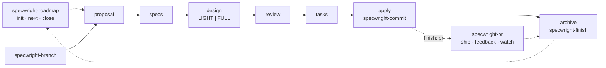

# Specwright

  

A lightweight spec-driven development bundle for AI coding agents, built on [OpenSpec](https://github.com/Fission-AI/OpenSpec). It keeps OpenSpec's small artifact set and adds what OpenSpec leaves out — **architecture reasoning scaled to the change**, test discipline, a git and GitHub PR workflow, and project-level planning — as one custom schema plus a handful of auto-activating skills. No OpenSpec core changes.

## ✨ What it adds

- 🏗️ **Architecture reasoning, scaled to the change.** Every design starts with a six-trigger triage. No trigger → a few lines. Any trigger → state ownership, failure visibility, resource bounds, flow gaps and a mechanism ledger, then a fresh-context, ideally cross-model review that gates the tasks.
- 🧪 **Test discipline.** Every requirement needs a failure scenario; every scenario maps to a named test that goes red → green during apply.
- 📜 **Durable decisions.** Immutable, supersedable ADRs, indexed in the project's architecture file.
- 🌿 **Git workflow.** A branch per change, one commit per task, and a finish step that merges locally or goes through a GitHub PR.
- 🔁 **PR tooling.** Ship a PR with a useful description, resolve review feedback, watch CI and reviews in the background — with two small scripts instead of dozens of tool calls.
- 💸 **Cheap delegation.** The main agent plans and verifies; a cheaper implementer model does the tasks from a focused packet.
- 🗺️ **Project planning.** A big idea becomes a one-page strategy, an architecture baseline and a milestone roadmap; each milestone is a handful of OpenSpec changes.

## 🔄 How it fits together



| Phase | Owned by | What happens |
|---|---|---|
| Start a change | [`specwright-branch`](skills/specwright-branch/SKILL.md) | Clean `main` check, then `<prefix>/<change-name>` branch |
| proposal → specs → design → review → tasks | [`schemas/specwright`](schemas/specwright/schema.yaml) | Artifacts with architecture triage and a review gate |
| Apply | [`specwright-commit`](skills/specwright-commit/SKILL.md) + [`specwright-implementer`](agents/claude/specwright-implementer.md) | One commit per task, orchestrator re-verifies delegated work |
| PR | [`specwright-pr`](skills/specwright-pr/SKILL.md) | Ship, address feedback, watch CI (`finish: pr`) |
| Archive | [`specwright-finish`](skills/specwright-finish/SKILL.md) | Archive commit, then local `--no-ff` merge or push to the PR |
| Across changes | [`specwright-roadmap`](skills/specwright-roadmap/SKILL.md) | Strategy, architecture baseline, milestones |

---

## ⚡ Install / Update

> **Prerequisites:** the OpenSpec CLI (`npm i -g @fission-ai/openspec`), `openspec init` run in the project, `git`, and `gh` 2.40 or later for the PR skills. The PR scripts need `bash` (Git Bash on Windows).

Copy the prompt below and paste it into your coding agent. **The same prompt installs and updates.**

```text
Install/Update Specwright

Install or update Specwright from https://github.com/sh1ny/specwright into the
current project. Follow the steps in order. Ask the user where indicated - do
not assume answers. Every step is safe to repeat, so re-running this prompt
also repairs an interrupted or partial install.

Step 1 - Check prerequisites
- Run `openspec --version`. If it fails, tell the user to install it
  (`npm i -g @fission-ai/openspec`) and STOP.
- Run `openspec list --json` in the code checkout and read `root`.
  - `"root": null`: if the error names this project's `openspec/config.yaml`
    (it starts with `Declared in` or `Invalid store declaration in`), show
    its message and fix and STOP. Otherwise tell the user to run
    `openspec init` first and STOP.
  - Otherwise `<root>` below means `root.path`. It is the code checkout
    for a repo-local project, or a store checkout (OpenSpec stores, 1.14.1
    or later) elsewhere. Say which.
- The schema and `config.yaml` go in `<root>/openspec/`. `specwright.yaml`,
  `.specwright/VERSION`, skills and agents go in the code checkout. When
  `<root>` is not the code checkout, never create `openspec/specs/`,
  `openspec/changes/` or `openspec/schemas/` in the code checkout (a real
  `openspec/` root there would override the store), and leave its
  `openspec/config.yaml` (the `store:` pointer) as it is.

Step 2 - Choose targets
Ask which agents this project uses (several may apply) and confirm the paths:
- Claude Code: skills → `.claude/skills/`, agents → `.claude/agents/`
- OMP: skills → `.claude/skills/` (OMP reads it), agents → `.omp/agents/`
- Codex: skills → `.agents/skills/`
- Other: ask for the skills directory.

Step 3 - Download and compare versions
- Clone https://github.com/sh1ny/specwright to a temporary directory
  (`git clone --depth 1`, or any other method that works).
- Read the downloaded `VERSION` and the installed
  `openspec/.specwright/VERSION` (missing = fresh install, or an earlier
  install that did not finish). Tell the user which applies: fresh install,
  update from <old> to <new>, or reinstall of <new>. Continue in every case.

Step 4 - Install files (track new vs updated)
- In every chosen skills directory, replace each `specwright-*` directory
  with the downloaded one: delete the installed copy, then copy the new one
  recursively, so files removed upstream do not linger. If an installed
  `specwright-*` directory has no downloaded counterpart, list it and ask
  before removing it.
- Copy `agents/claude/*.md` into `.claude/agents/` if Claude Code was chosen,
  and `agents/omp/*.md` into `.omp/agents/` if OMP was chosen. If an
  installed agent file has a different `model:` value than the downloaded
  one, the user changed it: keep their value and say so.
- Replace `<root>/openspec/schemas/specwright/` with the downloaded
  `schemas/specwright/`.
- Legacy openspec-git-flow: if `openspec-git-branch`, `openspec-git-commit` or
  `openspec-git-merge` skill directories exist in a chosen skills directory,
  or `openspec/.git-flow/` exists, list them and ask before removing them.
- Do not write `openspec/.specwright/VERSION` yet; Step 7 does, last.

Step 5 - Merge <root>/openspec/config.yaml (never remove unrelated content)
- If it does not exist, copy the downloaded `templates/openspec/config.yaml`.
- Otherwise:
  - `schema:` - if it is missing or `spec-driven`, set it to `specwright`. If
    it names another schema, ask the user before changing it (in a store,
    say the change applies to everyone who uses that store); if they
    decline, keep it.
  - `context:` - if there is no `context:` key, add `context: |` holding the
    lines from the downloaded `templates/openspec/config.yaml` (leave any
    commented-out example alone). Otherwise, a
    line is Specwright-managed when it starts with
    `MANDATORY: Invoke the 'specwright-`, `Project-level planning (strategy`
    or `Specwright settings (`. Remove every managed line (older wordings and
    duplicates alike), then append each downloaded context line once. Remove
    any line naming `openspec-git-branch`, `openspec-git-commit` or
    `openspec-git-merge`. Leave every other line alone, including the
    project's own lines that mention Specwright.

Step 6 - Settings (openspec/specwright.yaml in the code checkout)
- If it does not exist, copy the downloaded
  `templates/openspec/specwright.yaml`, then ask the user for:
  finish mode (`local` merges to main locally; `pr` goes through GitHub PRs),
  the GitHub login for pushes/PRs/replies, an optional review-request comment
  and the login that posts it, whether design reviews may call a different
  model's CLI (`review.cross_model`), and an optional pre-push validation command.
  If the project already has strategy, architecture or roadmap documents
  (e.g. STRATEGY.md, docs/architecture*, a roadmap or milestone plan), ask
  whether to point the `project:` paths at them instead of the defaults.
  Write their answers into the file.
- If it exists, keep the user's values and add only keys that are missing,
  with the downloaded defaults. List each added key with its default and its
  comment from the downloaded `templates/openspec/specwright.yaml`, and ask
  whether to keep the default. If the user's file has keys the downloaded
  file no longer has, list them and ask before removing them.

Step 7 - Verify, stamp the version, clean up
- Run `openspec schema validate specwright` inside `<root>`.
- Every file of the downloaded `skills/specwright-*` directories exists,
  with the same content, in every chosen skills directory, and nothing else
  is in them.
- Every downloaded agent file exists in each chosen agents directory (the
  `model:` line may differ, per Step 4).
- `<root>/openspec/config.yaml` has `schema: specwright` (or the schema the user
  chose to keep - then report "installed, but not the default schema"),
  every downloaded context line exactly once, and no other managed line.
- `openspec/specwright.yaml` has every key in the downloaded
  `templates/openspec/specwright.yaml`, unless
  the user chose otherwise in Step 6.
- If every check passes, copy `VERSION` to `openspec/.specwright/VERSION`.
  If any fails, do not write it: report each failed check and how to fix it,
  and never claim success.
- Delete the temporary directory.

Step 8 - Report briefly: version change (fresh, <old> → <new>, or
reinstall), directories used, skills and agents installed (new vs updated,
models kept), config and settings created/merged/unchanged (keys added or
removed), legacy files removed, and the result of each Step 7 check. When `<root>`
is a store, list the files this install left uncommitted there (by path,
from `git status --porcelain` in the store) and say the user commits them in
the store; this prompt never commits. Tell the user that new skills and
agent definitions load only in a new agent session started after this
install: start one before relying on them.
```

## ⚡ First Steps After Install

1. **Start a change** — `specwright-branch` checks for a clean `main` and creates the branch first:
   - `/opsx:propose <idea>` or `/opsx:ff <name>` writes every artifact in one go;
   - `/opsx:new <name>` scaffolds it, then `/opsx:continue` writes one artifact per run.
2. **Review gate:** the design triage picks LIGHT or FULL; FULL designs are reviewed in a fresh context (by a different model unless `review.cross_model: false`) before tasks can be written.
3. **Apply** with `/opsx:apply` — task groups go to `specwright-implementer`, each verified task becomes its own commit.
4. **PR mode:** the PR opens when apply finishes; `specwright-pr` **watch** handles reviews and CI, and once it is green offers to archive on the branch. Then merge on GitHub.
5. **Archive** with `/opsx:archive` — `specwright-finish` merges locally or pushes the archive commit to the PR.

**Several agents at once?** Give each change its own `git worktree`: the skills switch branches in the checkout they run in.

**A whole project instead of one change?** Give the idea to `specwright-roadmap` **init**, then use **next** to start each change and **close** to finish a milestone.

---

## 🧩 What's Inside

### Schema

[`schemas/specwright/`](schemas/specwright/schema.yaml) — forked from OpenSpec's `spec-driven` (1.14.1). `proposal` and `specs` stay close to upstream so archive and validate keep working.

| Artifact | Template | Adds over `spec-driven` |
|---|---|---|
| `proposal` | [proposal.md](schemas/specwright/templates/proposal.md) | Names its roadmap milestone when one exists |
| `specs` | [spec.md](schemas/specwright/templates/spec.md) | A failure/edge scenario per requirement; assertable THENs |
| `design` | [design.md](schemas/specwright/templates/design.md) | Six-trigger triage → `TIER: LIGHT \| FULL`; FULL sections; ADR rules |
| `review` | [review.md](schemas/specwright/templates/review.md) | **New.** Fresh-context, cross-model review; machine-readable `VERDICT:` |
| `tasks` | [tasks.md](schemas/specwright/templates/tasks.md) | Verdict precheck; scenario → test map; failing test first |

### Skills

| Skill | Activates on | Owns |
|---|---|---|
| [`specwright-branch`](skills/specwright-branch/SKILL.md) | New change (`/opsx:new`, `/opsx:propose`, `/opsx:ff`) | Clean-main gate, prefix, feature branch |
| [`specwright-commit`](skills/specwright-commit/SKILL.md) | Apply (`/opsx:apply`) | Planning commit, one commit per task, end-of-apply check, PR handoff |
| [`specwright-finish`](skills/specwright-finish/SKILL.md) | Archive (`/opsx:archive`) | Archive commit, local merge or PR push, post-merge cleanup |
| [`specwright-pr`](skills/specwright-pr/SKILL.md) | "open a PR", "address review comments", "watch the PR" | `ship` / `feedback` / `watch` — see [description guide](skills/specwright-pr/references/description.md) and [feedback rubric](skills/specwright-pr/references/rubric.md) |
| [`specwright-debug`](skills/specwright-debug/SKILL.md) | Unexpected failures, bug reports, failing CI | Reproduce → trace → hypothesis → test-first fix; CI mode |
| [`specwright-roadmap`](skills/specwright-roadmap/SKILL.md) | "plan this project", "what's next on the roadmap", "close the milestone" | `init` / `next` / `close` / `status` — templates for [strategy](skills/specwright-roadmap/references/strategy.md), [architecture](skills/specwright-roadmap/references/architecture.md), [roadmap](skills/specwright-roadmap/references/roadmap.md) |

### Agents

| Agent | Claude Code | OMP | Role |
|---|---|---|---|
| `specwright-implementer` | [`sonnet`](agents/claude/specwright-implementer.md) | [`pi/smol`](agents/omp/specwright-implementer.md) | Implements one task group test-first from a packet; never commits |
| `specwright-reviewer` | [`inherit`](agents/claude/specwright-reviewer.md) | [`pi/slow`](agents/omp/specwright-reviewer.md) | Read-only reviewer; fallback when no cross-model CLI is available or `review.cross_model: false` |

Change the model in each file's `model:` line (Claude Code), or map the role aliases in `~/.omp/agent/config.yml` (OMP).

### Scripts

All in [`skills/specwright-pr/scripts/`](skills/specwright-pr/scripts/); bash + `gh` only.

| Script | Does |
|---|---|
| [`as.sh`](skills/specwright-pr/scripts/as.sh) | Runs a command as one GitHub login: pins the token per process, verifies it, and feeds it to both `gh` and `git push` (HTTPS to github.com only; SSH, prompts and inherited `http.extraHeader` auth are disabled inside it; run git from inside the target repo, since extraHeaders are scrubbed for the current repository only). Safe against a concurrent `gh auth switch`. |
| [`pr-snapshot.sh`](skills/specwright-pr/scripts/pr-snapshot.sh) | One GraphQL call → the whole PR as JSON (checks, unresolved threads and resolved ones with an unanswered reviewer comment, unhandled or edited comments, stale `CHANGES_REQUESTED` verdicts, and a `complete` flag when a list was cut off). `--reviewer login:role:seconds` adds whether each reviewer has reported on the current head (`reported` / `waiting` / `timed_out`). `--wait` polls in-process and wakes once (at once if the snapshot is already incomplete); one watcher per PR: a newer `--wait` on the same PR takes over and the older one exits 4; `--logs` appends failed CI logs. |
| [`pr-reply.sh`](skills/specwright-pr/scripts/pr-reply.sh) | Replies over REST, checks for a pending review, resolves the thread, optionally adds a 👍/👎 (`--react`), and marks the item handled on GitHub itself. `react` answers a follow-up with a reaction only; `--waiting` marks a "waiting on owner" reply, which keeps the item listed; `resolve` retries only a failed resolution. |

---

## ⚙️ Settings

`openspec/specwright.yaml` (template: [`templates/openspec/specwright.yaml`](templates/openspec/specwright.yaml)) — read by the skills; OpenSpec ignores it.

```yaml
finish: pr                      # local = merge to main locally, pr = GitHub PR
# main_branch: main             # omit to detect main / master

github:
  login: my-bot-account         # pushes, PRs, replies; empty = ambient gh account
  review_request:
    body: "@codex review"       # posted once per new PR; empty = none
    login: my-account
    after_fixes: true           # post again after each pushed fix round (reviewers that only run when tagged)

review:
  cross_model: true             # false = design reviews use the specwright-reviewer agent, never another model's CLI

project:                        # point at existing docs instead of duplicating them
  strategy: openspec/strategy.md
  architecture: openspec/architecture.md
  roadmap: openspec/roadmap.md
  adr_dir: docs/adr

pr:
  validate: "npm test"          # must pass before every push; empty = none
  max_fix_rounds: 2             # address-review-feedback commits allowed per PR
  after_limit: ask              # at the limit: ask = reply "waiting on owner" and stop, issues = file each new finding as an issue and reply with the link, stop = like ask, without offering more rounds
  react: true                   # 👍/👎 on every finding answered (right / wrong); default false
  poll_interval: 5m             # how often watch polls GitHub; default 5m
  reviewers:                    # keyed by login, without [bot]; replaces github.review_request
    chatgpt-codex-connector: { role: required, request: "@codex review" }   # runs only when tagged
    kody-ai:      { role: advisory, timeout: 15m }   # reviews every push
    kintsugimira: { role: advisory, timeout: 10m }
  # request_as: my-account      # posts the requests; default review_request.login, else github.login
```

Reviewers: `role` is `required` (default) or `advisory`, `timeout` defaults to 20m. Watch waits until every reviewer has reported on the head or timed out before a fix round, so one round covers all their findings. Ready needs every required reviewer to have reported; an advisory one, and its pending check, stops blocking once it has reported or timed out. Codex, Kody and Mira are recognised by their own signals (Codex's `Reviewed commit` SHA, Kody's check run, Mira's walkthrough); any other login counts as reported once it posts after the push.

`openspec/config.yaml` (template: [`templates/openspec/config.yaml`](templates/openspec/config.yaml)) carries the `context:` lines that make the git skills fire at the right phase.

---

## 🗄️ Stores

Specwright works with [OpenSpec stores](https://github.com/Fission-AI/OpenSpec) (OpenSpec 1.14.1 or later): planning kept in a standalone repo registered on the machine (`openspec store setup` / `openspec store register <path> --id <id>`), while the code lives in its own repo.

- **Which root is used.** Every skill reads `root.path` from `openspec list --json` and never assumes `./openspec/`. OpenSpec resolves it from a `store: <id>` pointer in the code repo's `openspec/config.yaml`, the global `defaultStore` (`openspec config set defaultStore <id>`), or `--store <id>` on a command. Prefer the pointer or `defaultStore`: a `--store`-only session is not seen by a later session without the flag. A root in another git repository is a store; a root in the code repo (top level or a nested folder) is repo-local and works as before.
- **One change in progress per store per machine.** OpenSpec registers one checkout per store, so a store on another change's branch is busy: the branch gate stops and names that branch. Finish or archive that change first. The gate itself holds a lock (`specwright-gate.lock` in the store's git dir) while it creates both branches; a lock left by an interrupted session is removed only after you confirm no other session is in its gate.
- **The PR pair.** A store-backed change has the same branch name in both repos and, in `finish: pr`, up to two PRs: the store PR (planning) and the code PR, linked to each other. The expected PR set is the PRs the change can have: a planning-only change (no code commits, marked with `specwright-change.yaml`) expects only the store PR. Watch, feedback and cleanup act on the expected PRs only, and the roadmap counts a store-backed change done only with proof that its code is merged too, or that it is planning-only; otherwise it shows "planning merged, code pending".
- **Store settings.** `planning_store:` in the code repo's `openspec/specwright.yaml` holds the store's `main_branch`, `login`, `validate` (runs in `<root.path>`; `pr.validate` never runs in the store) and `reviewers`. Each defaults to the code repo's value; see the commented block in the template.
- **Install.** The install prompt puts the schema and the `context:` lines in `<root.path>/openspec/` and leaves those files uncommitted in the store for you to commit; `specwright.yaml`, skills and agents go in the code repo.
- **References.** Stores listed under `references:` in a project's `config.yaml` are read-only: the skills may read their specs (`openspec context --json`) but never branch, commit or push there. An unresolved reference is named in the report, and the work goes on.
- **`Feedback-Round` trailer.** Review-fix commits now carry a `Feedback-Round: <n>` trailer, in repo-local projects too, so the round limit counts the same in one repo or two. Branches from before this count their `address review feedback` commits as before.

---

## 📖 Behavior Reference

<details>
<summary><b>Design triage</b> — which changes get the full architecture treatment</summary>

| Trigger | Applies when the change… |
|---|---|
| T1 Components | adds a component, or touches 3+ with directed relationships |
| T2 State | adds or changes persistent state, caches, or a 3+ state machine |
| T3 Concurrency | adds background work, workers/isolates, async pipelines, retries |
| T4 Boundaries | touches a data format, migration, shared interface, IPC or external system |
| T5 Volume | handles data or work that can grow without a fixed bound |
| T6 Risk | involves security, money, data loss, or unrecoverable user data |

No trigger → **LIGHT** (triage, context, decisions). Any trigger → **FULL**: diagrams, state & ownership, failure & visibility, resource bounds, flow & state gaps, mechanism ledger. When unsure, a trigger applies.
</details>

<details>
<summary><b>Review verdicts</b></summary>

| Verdict | Means |
|---|---|
| `SKIPPED_LIGHT` | LIGHT tier; triage re-checked, no review needed |
| `APPROVE` | Tasks may be written |
| `APPROVE_WITH_CHANGES` | Apply the listed changes; tasks wait for `CHANGES_APPLIED: yes` |
| `REVISE` | Fix and re-review; two REVISE rounds in a row escalate to the user |
| `USER_OVERRIDE` | After escalation, the user decided to proceed; their words and the open findings are recorded |

A verdict covers only what was reviewed: editing proposal, specs or design afterwards voids it.
</details>

<details>
<summary><b>Branch prefixes and commit messages</b></summary>

| Change name starts with | Branch |
|---|---|
| `add`, `feat`, `feature`, `implement`, `introduce` | `feat/` |
| `fix`, `bugfix`, `hotfix`, `patch`, `resolve` | `bugfix/` |
| `refactor`, `restructure`, `cleanup` | `refactor/` |
| `docs`, `doc`, `document` | `docs/` |
| `chore`, `bump`, `deps`, `ci`, `build` | `chore/` |
| anything else | `feat/` |

| When | Message |
|---|---|
| Apply start | `<type>(<change>): add planning artifacts` (`<type>` = branch prefix, `bugfix` → `fix`) |
| Each task | `<type>(<change>): task X.Y <task text>` (≤ 72 chars) |
| After archive | `<type>(<change>): archive change` |
| Local merge | `merge: <change>` |

Files are always staged by name — never `git add -A`, never all of `openspec/` — and pre-existing untracked files are left alone.
</details>

<details>
<summary><b>PR modes</b></summary>

| Mode | Does | Never |
|---|---|---|
| `ship` | Push, create/update the PR with `--body-file`, post the review request | Push the default branch |
| `feedback` | One snapshot → judge all items → fix → validate once → one commit → one reply (and 👍/👎) per finding, resolve; acknowledgement follow-ups get a reaction only (and resolve the thread if it was still open) | Resolve needs-human threads; go past `max_fix_rounds` |
| `watch` | Background wait → wait for every reviewer on the head → feedback first → ignore CI for stale heads → fix all failing checks in one pass → at ready, offer the archive on the branch; report stale `CHANGES_REQUESTED` verdicts | Merge, rebase, force-push, approve workflow runs, dismiss reviews |
</details>

---

## 🧪 Evals

[`evals/git-workflow/`](evals/git-workflow/) holds scripted evals for the git skills: [`fixtures.py`](evals/git-workflow/fixtures.py) builds scratch repos, [`evals.json`](evals/git-workflow/evals.json) lists the cases, and [`grade.py`](evals/git-workflow/grade.py) checks the resulting git state. Run with [skill-creator](https://github.com/anthropics/skills) (with-skill vs. baseline runs), then `python evals/git-workflow/grade.py <iteration-dir>`.

Store evals (`eval-store-*`) need two repos, so the fixture is a directory, not a repo: `code/` is the project, `store/` is its OpenSpec store. The fixture also writes `eval.env`. The agent under test must run `source <repo>/eval.env` first and work from `<repo>/code`. The file points the OpenSpec registry and config (`XDG_DATA_HOME`, `XDG_CONFIG_HOME`) and Specwright's watch state (`SPECWRIGHT_STATE_DIR`) at the run directory, and puts a fake `gh` first on `PATH`. Your own registry and state are never touched. The fake `gh` ([`evals/fakes/gh.py`](evals/fakes/gh.py)) keeps its state in `gh-state.json` and logs every call to `gh-log.jsonl`; `grade.py` reads both repos and that log.

Test the fake `gh` with `python -m unittest discover evals/pr-pair`.

To check that delegated agents can load skills, start a new session after the install, dispatch `specwright-implementer` with a small packet that names one installed skill (with its `SKILL.md` path) and look for its `Skill` call before any edit. A session that was already running before the install still has the old agent definitions, so a check there proves nothing: start a new session and run it again.

---

## 🔧 Manual Installation

1. `git clone --depth 1 https://github.com/sh1ny/specwright.git /tmp/specwright`
2. Copy `skills/specwright-*` into your agent's skills directory, and `agents/claude/*` into `.claude/agents/` and/or `agents/omp/*` into `.omp/agents/`.
3. Copy `schemas/specwright/` to `openspec/schemas/specwright/` and `VERSION` to `openspec/.specwright/VERSION`.
4. Set `schema: specwright` and append the `context:` lines from [`templates/openspec/config.yaml`](templates/openspec/config.yaml) to your `openspec/config.yaml`; copy [`templates/openspec/specwright.yaml`](templates/openspec/specwright.yaml) to `openspec/specwright.yaml` and fill it in.
5. `openspec schema validate specwright`, then restart your agent.

## 🛠️ Contributing

Specwright is developed with Specwright. See [CONTRIBUTING.md](CONTRIBUTING.md) for setup, the source vs. installed layout, conventions and releases.

## 🗑️ Uninstall

1. Delete the `specwright-*` skill directories and the two `specwright-*` agent files.
2. Delete `openspec/schemas/specwright/`, `openspec/.specwright/` and `openspec/specwright.yaml`.
3. Remove the Specwright lines from `openspec/config.yaml` and set `schema:` back to `spec-driven`.
4. Restart your agent.

## 💡 Credits

- Schema forked from OpenSpec's `spec-driven` ([MIT](schemas/specwright/LICENSE-OpenSpec)).
- Planning and PR workflow ideas from [Compound Engineering](https://github.com/EveryInc/compound-engineering-plugin).
- Review gate and test plan from the [anvil](https://github.com/jikkujoyce/openspec-schemas) schema; ADRs from [intent-driven](https://github.com/intent-driven-dev/openspec-schemas).
- Git workflow from [openspec-git-flow](https://github.com/sh1ny/openspec-git-flow), which Specwright replaces.
