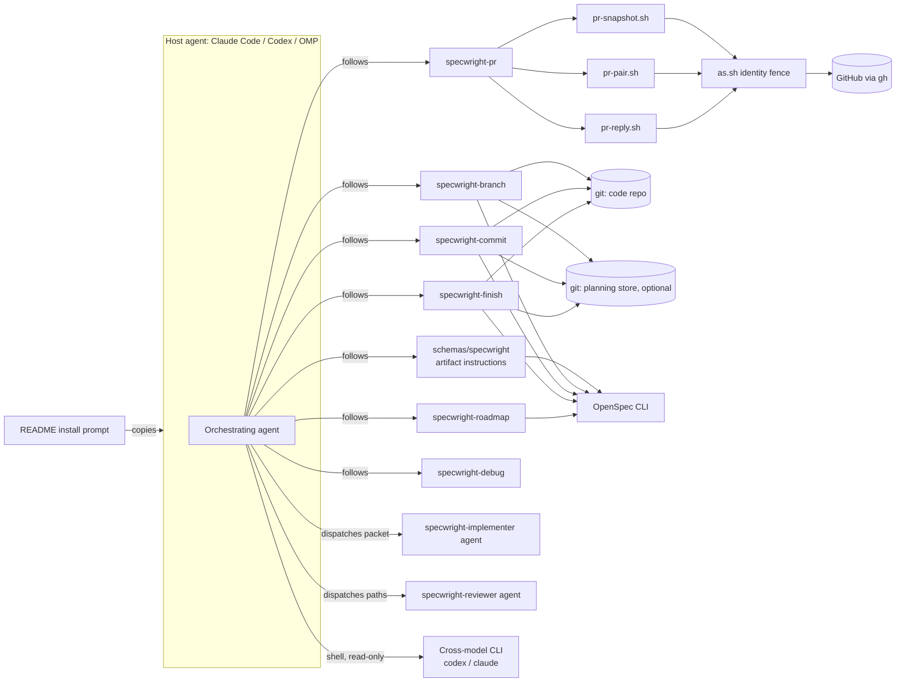

# Specwright Architecture

Specwright is not a running service. It is text and small scripts that an AI agent loads and follows inside a user's project. "Components" below are therefore instruction packages, scripts and the external tools they drive. The agent is the only process that runs them.

## System triage

- **T1 Components:** applies. There are six skills, two agents, a schema, four PR scripts and an install prompt, with directed calls between them (see Components).
- **T2 State:** applies. Change artifacts, `tasks.md` ticks, commit trailers, PR reply markers, the feedback pass record and the store gate lock are all persistent state.
- **T3 Concurrency:** applies. Several agents share one machine, one `gh` login store and one planning store. `watch` polls in the background, and reviewers answer asynchronously.
- **T4 Boundaries:** applies. The schema is OpenSpec's extension point; `specwright.yaml` is a shared, versioned settings format; commit subjects, trailers and PR markers are formats that later runs parse; GitHub and the model CLIs are external systems.
- **T5 Volume:** applies. PR threads, comments and checks grow without a fixed bound, and so does commit history per change.
- **T6 Risk:** applies. The scripts push and comment under a GitHub identity, and cross-model review sends code to another provider.

## Components

| Component | Responsibility | Owns (state) | Talks to via (contract) |
|---|---|---|---|
| `schemas/specwright` | Artifact sequence (proposal, specs, design with triage, review gate, tasks) and apply instructions | Artifact templates | OpenSpec schema format (`openspec schema validate`) |
| `specwright-branch` | Clean-main gate, `<prefix>/<change-name>` branch, store branch and gate lock | Store gate lock | git; `openspec list --json` |
| `specwright-commit` | One commit per task, Reconcile, completion check | Task commits and their subjects/trailers | git; `tasks.md` |
| `specwright-finish` | Archive commit, local `--no-ff` merge or hand-off to the PR | Archive commit, merge commit | git; OpenSpec archive |
| `specwright-pr` + scripts | Ship, feedback and watch for one PR or a code/store PR pair | Feedback pass record, PR reply markers | `gh` GraphQL/REST through `as.sh`; JSON on stdout |
| `specwright-roadmap` | Strategy, architecture baseline, milestones | `openspec/strategy.md`, `architecture.md`, `roadmap.md`, `docs/adr/` | Status is derived from git and GitHub |
| `specwright-debug` | Root-cause debugging discipline | None | None |
| `specwright-implementer` agent | Implements one task group test-first from a packet | Nothing committed: the orchestrator verifies, ticks and commits | Packet in, evidence report out |
| `specwright-reviewer` agent | Fresh-context review when no cross-model CLI is used | `review.md` it writes | File paths in, `VERDICT:` line out |
| Install prompt (README) | Installs or updates the copies into a project; keeps local `model:` lines | `openspec/.specwright/VERSION` | Copy layout in `CONTRIBUTING.md` |
| Evals (`evals/`) | Graded agent runs and script tests, with a fake `gh` | Fixtures | `evals.json`, pytest |

## State ownership

| State | Sole writer | Lifetime | Invalidation / rebuild | Authoritative copy |
|---|---|---|---|---|
| Change artifacts (`openspec/changes/<name>/`) | Orchestrating agent, through the schema | Until archive | Drift rule: separate `amend <artifact>` commit | Planning repo branch, then main |
| `tasks.md` ticks | Orchestrator (never the implementer) | Until archive | Reconcile against commits | Planning repo (store when store-backed) |
| Task commits (`task X.Y` subject, `Code-Changes: none`) | `specwright-commit` | Permanent | Never rewritten without the user | Change branch, then main |
| `Feedback-Round: <n>` trailers | `specwright-pr` feedback | Permanent | The round count is derived from them | Change branch in either repo |
| PR reply markers (`specwright:handled …`) | `pr-reply.sh` | Life of the PR | An item edited after the reply counts as unhandled again. Gap: an edit made while the fix was in progress is hidden by the later reply (#33) | GitHub |
| Feedback pass record (store-backed changes only) | The one session running feedback for the change, through `pr-pair.sh pass write/done`. Gap: that exclusivity is assumed, not enforced (#32) | One feedback pass | Deleted at `pass done`; a leftover record blocks the next pass until resumed | `~/.cache/specwright/feedback/` (or `SPECWRIGHT_STATE_DIR`) |
| Watch ownership token | The newest `pr-snapshot.sh --wait` on the PR | One watch | Released on exit; an older watcher that sees another token exits 4. Gap: cleanup can delete a newer watcher's token, leaving no watcher (#39) | `~/.cache/specwright/watch/<owner>-<repo>-<pr>` |
| Store gate lock | `specwright-branch` | The gate only | Never auto-removed; the user confirms removal | `<store git-common-dir>/specwright-gate.lock` |
| Settings | The user (install prompt merges) | Project lifetime | Install keeps local values | `openspec/specwright.yaml`, `openspec/config.yaml` |
| Installed version | Install prompt, last step | Until next install | Rewritten on install | `openspec/.specwright/VERSION` |

## Boundaries and contracts

- **OpenSpec:** only through the custom schema and the CLI (`openspec list --json`, `instructions`, `archive`, `context --json`). The OpenSpec version is pinned in the README badge and `CONTRIBUTING.md`, but not enforced at install (#37).
- **Settings:** `specwright.yaml` keys are documented in `templates/openspec/specwright.yaml` and the README. A new key has a safe default, so a missing key keeps earlier behaviour.
- **Git evidence formats:** commit subjects `<type>(<change>): task X.Y …`, trailers `Feedback-Round:` and `Code-Changes: none`, and archive/merge subjects. Later runs and roadmap status parse these, so changing them is a workflow change (minor version).
- **Script I/O** (ADR 0002): `pr-snapshot.sh` and `pr-pair.sh` print one JSON document (`pr-snapshot.sh --logs` appends plain log text); `pr-reply.sh` prints one plain line per action. Exit codes signal stop conditions. Scripts use only `bash`, `gh` (built-in jq) and the Python standard library.
- **GitHub identity** (ADR 0004): every authenticated call for a configured login goes through `as.sh <login>`, and `gh auth switch` is never run. With `github.login` empty (the shipped default), calls use the active account unfenced (#38). `pr-pair.sh` fences `gh` calls per repo, but its `git` calls on the store run with the code account's credentials (#35).
- **Cross-model review:** a read-only CLI run that prints the complete artifact and ends with one `VERDICT:` line. Only the change under review leaves the machine.

## Resource bounds and failure visibility

| Flow / store | Bound | At the bound | On failure | Who finds out |
|---|---|---|---|---|
| PR snapshot | 100 per list (threads, comments, reviews, checks) | `complete: false`, `truncated: [...]`; feedback and watch hand over to the user | `gh` error → non-zero exit | The user, through the hand-over |
| Feedback rounds | `pr.max_fix_rounds` (default 2) | `pr.after_limit`: ask, file issues or stop | Store-backed: the pass record resumes an interrupted pass. Repo-local: no record; a pass interrupted after its last fix was pushed ends in "waiting on owner" (#34). A recovered partial fix is counted as an extra round (#29) | The user at the limit; the agent on resume |
| Watch polling | `pr.poll_interval` (default 5m); reviewer timeout per head (default 20m) | Advisory reviewer stops blocking; required reviewer → ask | Poll error → retry next interval. Gaps: pair readiness does not check that a snapshot matches the current PR head (#31); a cleanup race can delete the newer watcher's token, and that watcher then exits 4 and stops silently (#39) | The agent's watch loop, then the user; nobody in the #39 case |
| Fully paginated metadata reads (`pr-pair.sh` discovery, linking, recovery; after-limit issue reuse) | None: every page is read and held in memory; issue reuse scans all issues once per finding (F × I) | — | Large histories slow every call and grow memory (#40) | Nobody until a call is slow or fails |
| Network commands (`gh`, `git` in the PR scripts) | No Specwright deadline. The watch timeout counts sleep intervals, not elapsed time, and cannot interrupt a poll that hangs | — | A hung command blocks timeout reporting and ownership checks (#40) | Nobody until the user notices |
| Install / update | One project at a time | — | Interrupted update can leave deleted skills; a store's shared schema is replaced for every project (#36) | The user, on the next failing run |
| Design review | At most two rounds (roadmap baseline); one verdict line | REVISE escalates to the user (USER_OVERRIDE) | CLI missing → `specwright-reviewer`; neither → stop | The user |
| Store gate | One holder (atomic `mkdir`) | Second gate stops and names the owner | Interrupted gate leaves the lock → the user confirms removal | The user |
| Task commits | One per task | — | A ticked task without a commit is a gap → Reconcile asks | The agent, then the user |

## Known gaps

Defects where the code does not yet meet this baseline, found in the baseline review (`openspec/architecture-review.md`) and earlier PR reviews. The roadmap schedules them. Issue numbers refer to sh1ny/specwright.

| Gap | Issue |
|---|---|
| Pair readiness accepts a snapshot of another PR or an old head | #31 |
| Feedback pass record has no owner; two sessions can both write it | #32 |
| A reviewer edit during a fix is hidden by the later reply | #33 |
| Repo-local feedback cannot recover a pass interrupted after the last fix was pushed | #34 |
| `pr-pair.sh` git calls on the store use the code account | #35 |
| `rounds` counts a recovered partial fix as an extra round | #29 |
| Adopting a newly found code PR skips the pair-link repair (unverified) | #30 |
| `pass done` deletes the record before a `rerun` reaction is sent | #25 |
| `pass write` accepts a malformed `prs` map | #26 |
| Install/update has no lifecycle for running sessions or shared stores | #36 |
| OpenSpec pin is not enforced | #37 |
| Empty `github.login` (default) is unfenced | #38 |
| Watch cleanup can delete a newer watcher's token, leaving no watcher | #39 |
| Unbounded metadata reads and no command deadlines in the PR scripts | #40 |

## In-force ADRs

| ADR | Decision | Supersedes |
|---|---|---|
| [0001](../docs/adr/0001-build-on-unmodified-openspec.md) | Extend OpenSpec only through a schema, skills, agents and templates installed as copies | — |
| [0002](../docs/adr/0002-agent-instructions-with-thin-scripts.md) | The agent follows instructions; deterministic work goes to small bash + gh + python3 scripts | — |
| [0003](../docs/adr/0003-git-and-github-as-the-state-store.md) | Git history and GitHub hold workflow evidence; local state is only recoverable working state | — |
| [0004](../docs/adr/0004-process-scoped-github-identity.md) | Every authenticated GitHub call runs under a process-scoped, verified login | — |
| [0005](../docs/adr/0005-orchestrator-implementer-reviewer-split.md) | The orchestrator verifies and commits; an implementer agent builds; reviews run in a fresh context, cross-model when possible | — |
| [0006](../docs/adr/0006-openspec-resolves-the-planning-root.md) | OpenSpec resolves where planning lives; store-backed changes pair branches and commits across two repos | — |
