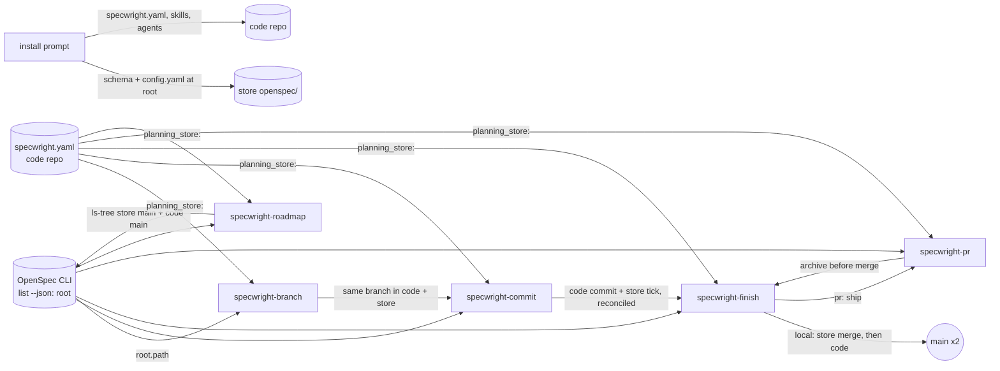
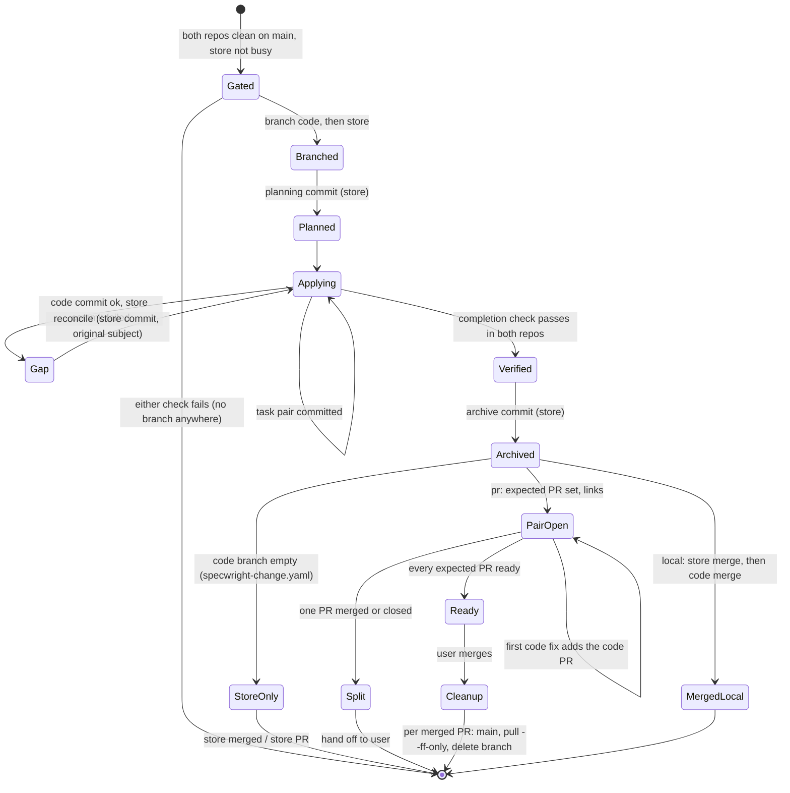
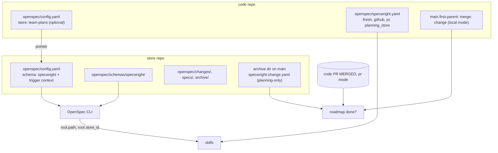

# Design

## Triage

| Trigger | Applies? | Evidence |
|---|---|---|
| T1 Components (new component, or 3+ with directed relationships) | Yes | Five skills (`specwright-branch`, `-commit`, `-finish`, `-pr`, `-roadmap`), two agents and the installer must agree on one shared "planning repo" notion and pass it along the chain branch → commit → finish → pr → roadmap. |
| T2 State (persistent state, caches, 3+ state machine) | Yes | A second git repo with its own branch, commits and PR. A change's lifecycle now spans two repos whose states can disagree: a branch on one only, a missing store commit, one PR merged. |
| T3 Concurrency (background work, workers/isolates, async, retries) | Yes | `specwright-pr` **watch** runs background waits (`pr-snapshot.sh --wait`, `skills/specwright-pr/SKILL.md:85`). With two PRs, two waits run at once and either can wake the loop. |
| T4 Boundaries (data format, migration, shared interface, IPC, external) | Yes | New `planning_store:` block in `openspec/specwright.yaml` (a settings format users edit), new commit trailers (`Code-Changes:` on planning-only tasks, `Feedback-Round:`) and a `specwright-change.yaml` marker that later runs parse, OpenSpec's `root` JSON contract, a second GitHub repository, and the install file layout. |
| T5 Volume (grows without a fixed bound) | No | Fixed: one extra repo and one extra PR per change. Commits per change are bounded by the task count. |
| T6 Risk (security, money, data loss, unrecoverable user data) | Yes | Git writes in a second repo the user may also be editing. Wrong staging or a wrong branch could commit or merge someone else's planning work, and a store push with the wrong identity publishes it. |

TIER: FULL

## Context

The problem and scope are in proposal.md, and the behavior contract is in `specs/planning-stores/spec.md`. The approach depends on the facts below, all verified in `@fission-ai/openspec` 1.14.1 (`dist/`) and this repo.

- **Root selection** (`core/root-selection.js`):
  - `--store` wins.
  - Otherwise the nearest `openspec/` that qualifies wins. It qualifies by having `specs/` or `changes/`, or a config file (`findQualifyingRootSync`; `classifyOpenSpecDir` in `core/project-config.js:509-513`).
  - A config-only `openspec/` with a `store:` pointer resolves to that store.
  - With no qualifying folder, `defaultStore` applies.
  - An `openspec/` holding only `specwright.yaml` or `schemas/` does not qualify, so it never shadows a store.
- **Root JSON.** `toRootOutput` emits `root.path`, `root.source` and, for stores, `root.store_id` (`core/root-selection.js:297-302`).
  - `openspec list --json` returns the root without naming a change.
  - `openspec status --change <name>` throws once the change directory is gone (`commands/workflow/shared.js:139-146`). Archive moves that directory (`core/archive.js`), so `status` cannot be used to find the root after archive.
- **Commands without root selection.** `openspec templates` and `openspec schema validate` resolve schemas from `process.cwd()` and take no `--store` flag (`commands/workflow/templates.js:14-21`; `commands/schema.js`).
  - Project schemas are read from `<root>/openspec/schemas/` (`core/artifact-graph/resolver.js:41`).
  - So the `specwright` schema and the `config.yaml` `context:`, which carries the mandatory skill triggers, must live under the resolved root, and these two commands must run there.
- **One checkout per store.** The registry maps one store id to one checkout path per machine, and registering a second checkout of the same store under another id is rejected (`core/store/registry.js:22-38`).
- **Global state locations.** The store registry is in the data dir, which `XDG_DATA_HOME` overrides (`core/global-config.js:44-51`). `defaultStore` is in the config dir, which `XDG_CONFIG_HOME` overrides (`core/global-config.js:20-37`). Watch state is under `$SPECWRIGHT_STATE_DIR` (`skills/specwright-pr/scripts/pr-snapshot.sh:57`).
- **The identity wrapper is per working directory.** `as.sh` scrubs inherited `http.extraHeader` only for the repository it runs in, "not one selected with git -C/--git-dir" (`skills/specwright-pr/scripts/as.sh:13-14`).
  - Store pushes and store `gh` calls must therefore start inside the store.
  - `pr-snapshot.sh` and `pr-reply.sh` already accept `--repo owner/name` (`pr-snapshot.sh:29`, `pr-reply.sh:28`).
- **Repo-local assumptions to replace:**
  - `specwright-branch` gates only the cwd repo (`skills/specwright-branch/SKILL.md:14-18`).
  - `specwright-commit` refuses stores (`skills/specwright-commit/SKILL.md:19`) and stages `openspec/changes/<name>/` in the cwd repo (`:20`).
  - `specwright-finish` stages archive paths in the cwd repo (`skills/specwright-finish/SKILL.md:13,16`).
  - `specwright-pr` feedback writes spec fixes into the cwd repo's archive (`skills/specwright-pr/SKILL.md:66`), counts rounds on the current branch (`:59`), stops on a single PR's MERGED or CLOSED state (`:87`), and leaves existing descriptions alone (`:53`).
  - `specwright-roadmap` reads `git ls-tree <main> openspec/changes/archive/` in the cwd repo (`skills/specwright-roadmap/SKILL.md:18`) and picks `next` from done prerequisites (`:39-42`).
  - The reviewer agents read the template from `openspec/schemas/specwright/templates/review.md` (`agents/claude/specwright-reviewer.md:17`, `agents/omp/specwright-reviewer.md:18`).
- **No ADRs.** There is no `openspec/architecture.md` and no `docs/adr/`.

## Decisions

### D1: The planning repo is identified by git repository, and store commands run inside it

- **Choice:**
  - **Identify the repo.** Resolve `root.path` (D2). Then read `git -C <root.path> rev-parse --path-format=absolute --git-common-dir --show-toplevel` and compare it with the code checkout's values.
    - Different common dir: the change is store-backed.
    - Same common dir and same toplevel: the change is repo-local. This covers today's layout and a store folder committed inside the code checkout.
    - Same common dir, different toplevel: the root is in another worktree of the code repository. Worktrees share refs but each has its own HEAD and index, so a commit there would land on that worktree's branch. Specwright stops before any write and names both worktrees (spec "Root in another worktree of the code repo").
  - **Build paths from the root.** Every planning path is built as `<root.path>/openspec/...`. It is then made relative to the planning repo's `--show-toplevel` for staging and `git ls-tree`.
  - **Two working directories, by command kind.**
    - Git, `gh` and `as.sh` (by absolute script path) act on a repository, so each store command runs in one shell call that starts with `cd "<store checkout toplevel>"`. `as.sh` only scrubs headers for the repository it starts in.
    - `openspec templates` and `openspec schema validate` have no root selection and resolve schemas from `process.cwd()`, so they run with `cd "<root.path>"`. For a root nested inside its repository (`<store toplevel>/planning/`), that is the nested folder, not the toplevel (spec "Schema lookup with a root nested in the store repo").
    - `git -C` is used only for read-only queries such as `rev-parse`, `status` and `ls-tree`.
  - **No git repo at the root.** If `root.path` is not inside a git work tree, Specwright stops and asks.
- **Rejected:**
  - Branching on `root.source`/`store_id`: a store can sit inside the code repo.
  - Comparing only `--git-common-dir`: it treats another worktree as the current checkout (round 2, N1).
  - Comparing only `--show-toplevel`: it treats another worktree as a separate store.
  - `git -C` for all store commands: it bypasses `as.sh`'s header scrub (Context).
  - A `planning: store` setting: it duplicates what OpenSpec resolves and goes stale.
- **Reversal cost:** low. It is the opening procedure of each skill.

### D2: Every skill resolves the root with `openspec list --json`; `status` only for active-change state

- **Choice:** every skill starts with the same "Planning repo" procedure.
  1. Run `openspec list --json` from the code repo, plus `--store <id>` when the session's workflow selected one. This needs no change name, writes nothing, and keeps working after archive.
  2. Apply D1.
  3. Announce the code repo and the planning repo in one line.
  - `openspec status --change <name> --json` is used only where active-change data is needed (apply progress, artifact paths).
  - **Finding the archive.** Finish uses the directory the archive workflow reports (`archivedAs` and `path` in OpenSpec's archive JSON) when it is available. In a fresh session it applies OpenSpec 1.14.1's archive-name rule (`core/archive.js:23-28,1313-1325`): a change name that already begins with `YYYY-MM-DD-` is archived under that exact name; any other name is archived as `YYYY-MM-DD-<change-name>`. That gives `<archived-name>`, and the directory is `<root.path>/openspec/changes/archive/<archived-name>/`. For bulk archive, it takes every directory matching that rule for one of the archived changes that `git status --porcelain` in the planning repo shows as new (round 7, N25).
  - **Branch gate.** The rule "run nothing from openspec until the gate passes" becomes "no OpenSpec command that writes". `list --json` is allowed.
- **Rejected:** `status --change` everywhere, which fails after archive (Context). A shared `planning-root.sh` across skills was also rejected: skills install independently, and `${CLAUDE_SKILL_DIR}` points at each skill's own folder. Persisting the root in a state file was rejected as a second source of truth that goes stale.
- **Reversal cost:** low.

### D3: The same branch name in both repos, created only after both pass

- **Choice:**
  - `specwright-branch` runs its checks (repo, main, clean tree, existing branch) on the code repo and then the store. The store has its own main detection: `planning_store.main_branch`, else `main`, else `master`.
  - **Gate lock.** Before checking the store, the gate takes an exclusive lock: `mkdir "<store --git-common-dir>/specwright-gate.lock"`, which is atomic and fails if the directory exists. Inside it the gate writes `owner` (time, change name, code checkout path). The lock is held through both checks and both branch creations, then removed with `rm -r`; every stop on the way removes it too. A second session that cannot take the lock stops before touching either repo and reports the owner. Once the first session has created its store branch, any later gate sees the store as busy, so the lock only needs to cover the gate itself (round 3, N13).
  - **Stale lock.** A lock left by an interrupted session is never removed automatically. The gate shows `owner` and asks the user to confirm that no other session is in its gate before removing it.
  - Branches are created only after both pass: code first, then store. If store creation fails, the empty code branch is removed with `git checkout <main> && git branch -d`.
  - A branch found in only one repo is offered as resume plus creating the missing one.
  - **Busy store checkout.** OpenSpec registers one checkout per store id per machine and rejects registering a second checkout of the same store under another id (`core/store/registry.js:22-38`). A store that is on another change's branch is "busy": the gate stops, names that branch, and says that one store holds one change in progress at a time on this machine. Changes against one store are therefore serialized per machine; the README says so. Code-side parallelism (`git worktree`) is unaffected, but all those worktrees share the one store checkout.
- **Rejected:**
  - A different store branch name (`plan/<name>`): it loses the 1:1 mapping that watch, finish and roadmap rely on.
  - Committing planning straight to the store's main: it skips review, which the mirrored workflow ruled out.
  - Switching the store's branch per session: it silently changes another session's planning view.
  - A second clone of the store registered under another id: OpenSpec rejects it (round 2, N2).
  - Relying on the busy check alone: two sessions can both see the store on main before either creates a branch (round 3, N13).
  - A lock file in the store's work tree: it would show up as an untracked file and fail the clean-tree check of the other session for the wrong reason.
- **Reversal cost:** medium. Branch names persist in PRs and history.

### D4: Paired task commits, reconciled before any new work

- **Choice:**
  - **Per task.** For each ticked task, commit the code files in the code repo, then commit `tasks.md` in the store with the same subject `<type>(<change-name>): task X.Y ...`. A planning-only task gets the store commit alone and is recorded as a code no-op: its store commit carries `Code-Changes: none`.
  - **Reconcile first.** Before ticking a task, before committing any task, and before a planning commit, `specwright-commit` runs a reconcile step in both repos.
    - Every ticked task without a matching store commit is a gap, except the one task this session ticked and is committing now. The normal loop (tick, code commit, store commit) is therefore never treated as recovery (round 4, N16; spec "Normal code task").
    - Any other gap comes from an earlier session or a failed step, and is closed before the current task proceeds.
    - A gap with a code commit is closed by the store commit below.
    - A gap without a code commit is never assumed to be a no-op: the tick alone does not say whether the code commit failed or the task changed no code. Specwright stops and asks. On "no-op", it makes the store commit with `Code-Changes: none`; on "changed code", it commits the task's code files by name and then the store tick (round 3, N12; spec "Restart before a task's code commit").
    - If the uncommitted `tasks.md` diff ticks exactly the tasks in one gap, the store commit is made with the original subject. Since reconcile runs before any further tick, a gap normally covers one task.
    - If one diff ticks several gap tasks, there is no commit and the user is asked (spec "Reconciliation cannot isolate the tick").
  - **Completion check.** It then runs `git log <main>..HEAD` in both repos and reports separately for each.
- **Rejected:**
  - Detecting gaps only at the completion check: a later commit absorbs the earlier tick, and the evidence cannot be rebuilt (review M2).
  - Store first, then code: it moves the same race to the code side, where leftovers can be absorbed by a later task touching the same file.
  - Committing `tasks.md` once at the end: it loses per-task evidence.
- **Reversal cost:** low.

### D5: Finish: store first; a planning-only marker in the archive; an expected PR set; links never rewrite descriptions

- **Choice:**
  - **Planning-only marker.** At archive time the change is planning-only when the code branch has no commits after `<main>` and no code PR from it exists in any state (complete discovery of D5 step 0; in `local` mode the PR check is skipped; a failed lookup writes no marker and stops). Finish writes `specwright-change.yaml` (`code_changes: none`) into the archived change directory and stages it in the archive commit. Because it is a file in the tree, it survives squash merges and branch deletion, which a commit trailer does not (round 2, N4). If a later feedback fix adds a code commit, the same pass deletes the file in a store commit before pushing the code fix (spec "Code work appears after the marker"). The `chore/archive-<name>` recovery branch carries only the archive repair. It gets the marker only when the original change meets the same planning-only test; a recovery branch says nothing about the change's code work (round 3, N11; spec "Archive recovery while the code PR is open").
  - **Expected PR set** (pr mode). Recomputed at ship, watch, feedback, archive-before-merge and cleanup:
    - a **code PR** is expected when a code PR from `<prefix>/<name>` into `<main>` exists in any state (found by the complete discovery of step 0 below; the newest one counts), or, before any exists, when the code branch has commits after `<main>`. Once a code PR exists, merging it, advancing main or deleting the branch does not drop it from the set (round 3, N10);
    - a **store PR** is expected exactly when the store has a GitHub `origin`.

    | Code PR exists or code commits | Store GitHub `origin` | Expected set | Ship report |
    |---|---|---|---|
    | Yes | Yes | Code PR + store PR | Both URLs |
    | Yes | No | Code PR | Code URL; store branch to share by hand |
    | No | Yes | Store PR | Store URL; "no code changes" |
    | No | No | None | Store branch to share by hand; nothing is watched |

    The empty code branch is kept until post-merge cleanup, so a code-producing feedback fix can still land on it. After such a fix the set gains the code PR, and the next ship step opens it (spec "Code fix turns a planning-only change into a pair").
  - **local.** Merge the store into its main with `--no-ff`, then the code repo if its branch has commits; an empty code branch is deleted with `-d`. On a store conflict, stop before the code repo. On a code conflict after the store merged, stop and report the split state (spec scenario).
  - **pr ship** (both PRs expected):
    0. **PR identity.** A PR belongs to the change only when its head branch is `<prefix>/<name>` and its head repository is the repo Specwright pushes to.
       - **Which repo.** Read from the checkout's own remote: `git remote get-url origin` and every URL of `git remote get-url --push --all origin`, each parsed to `<owner>/<name>` (HTTPS or SSH form, `.git` stripped). If the fetch URL and every effective push URL do not name the same GitHub repository, Specwright stops before publishing and names them; forks and mirrors as push targets are out of scope (round 6, N22; spec "Fetch and push URLs name different repositories"). The identity never comes from `gh repo view`, the login, `GH_REPO` or a `gh repo set-default` choice.
       - **Explicit binding.** Every repo-scoped `gh` command and both helpers get that identifier explicitly (`--repo <owner>/<name>`, or `repos/<owner>/<name>/...` for `gh api`), and the shell call runs with `GH_REPO` unset, so an inherited override cannot redirect a store lookup to the code repo (round 5, N17; spec "Inherited GH_REPO names the code repo").
       - **Complete discovery.** PR lookups do not use `gh pr list`: it fetches 30 results by default and filters by branch name only. They use `gh api --paginate "repos/<owner>/<name>/pulls?state=all&head=<owner>:<prefix>/<name>&per_page=100"`, which filters by head owner and branch on the server and pages through every result, then keep only PRs whose `head.repo.full_name` is `<owner>/<name>`. A same-named PR from a fork is ignored (round 4, N17). A failed or partial lookup means "unknown": Specwright stops and never treats the PR as absent. This one lookup serves ship discovery, expected-set membership, planning-only classification, cleanup and roadmap proof (round 6, N23; spec "Matching PR beyond the first page").
       - **Base.** Membership, planning-only classification and roadmap proof keep only PRs whose `base.ref` is that repo's main. An open matching PR with another base stops ship, naming the PR and its base (round 3, M7).
    1. Push the store branch and find or create the store PR.
    2. Push the code branch and find or create the code PR. A code PR created now has the store PR URL in its description.
    3. A PR that was created without the other's URL, or already existed, gets one comment with the other PR's URL and a marker naming that URL: `<!-- specwright:link store <url> -->` on the code PR, `<!-- specwright:link code <url> -->` on the store PR. The comment is skipped when a marker with the current peer URL exists, or the description already carries the link.
    4. **Peer changed.** If Specwright's own marker comment (found by marker prefix and authored by that repo's login) names another URL, for example a code PR closed unmerged and replaced, ship edits that comment to the current peer (`gh api -X PATCH repos/<owner>/<repo>/issues/comments/<id>`) instead of adding one. Descriptions and other users' comments are never edited (round 3, N14).
    - Existing descriptions are never edited, so existing PRs and re-runs are covered.
    - The code PR title is `<type>(<change-name>): <summary>`.
  - **Post-merge cleanup.** For each expected PR that is MERGED: check out that repo's main, `pull --ff-only`, and delete the change branch with `-d`, or `-D` only after the existing headRefOid check. An empty code branch is deleted with `-d`. A repo whose expected PR is open or closed unmerged keeps its branch and is reported (round 2, N6).
- **Rejected:**
  - Editing an existing code PR description to add the link: it breaks the no-rewrite rule (review M6).
  - Creating an empty code commit so a planning-only change still has a code PR: the PR would show nothing (review M3).
  - Vendoring the planning files into the code PR: the store would stop being the source of truth.
  - A `Code-Changes: none` trailer on the archive commit as roadmap evidence: squash merges with an edited message drop it (round 2, N4).
- **Reversal cost:** low for the procedure. Medium for the marker file and link comment formats, which later runs parse.

### D6: Store settings are an optional `planning_store:` block that inherits from the code settings

- **Choice:** `openspec/specwright.yaml` stays in the code repo and gains:
  ```yaml
  planning_store:            # only read when the change is store-backed
    main_branch:             # default: detect main, else master, in the store
    login:                   # default: github.login
    validate:                # default: empty (code pr.validate is not run in the store)
    reviewers:               # default: pr.reviewers; {} = none
  ```
  - Every other setting is shared.
  - The installer adds the block, commented out, to `templates/openspec/specwright.yaml`.
  - `planning_store.validate` runs with `<root.path>` as its working directory, like the other OpenSpec commands (D1), so a root nested inside the store checkout is selected. The suggested command is `openspec validate --all --strict` (round 3, N15).
- **Rejected:** a `specwright.yaml` inside the store, because several code repos may share one store and each needs its own finish mode and identity. Inheriting `pr.validate` was also rejected: a code test command is meaningless in the store.
- **Reversal cost:** medium. It is a user-written format.

### D7: Watch: one wait per expected PR, set-level terminal rules

- **Choice:**
  - **Waits.** One `pr-snapshot.sh --wait` runs per expected PR (D5), in the background, started inside its repo and always with `--repo <owner>/<name>` from D5 step 0. On a wake, handle that PR and restart only its wait.
  - **Set states:**

    | Expected set state | Watch does |
    |---|---|
    | Empty set | No watch. The ship report already named the store branch to share by hand. |
    | One expected PR, open | Single-PR watch, as today. When only the code PR is expected, the ready report names the store branch to share by hand. |
    | Two expected PRs, both open | Loop. Report ready only when both pass the existing readiness test (`skills/specwright-pr/SKILL.md:91`) in the same iteration. |
    | Two expected PRs, one merged or closed, the other open | Stop both waits and hand off. The report names which PR is in which state; nothing is archived or re-requested. |
    | Every expected PR merged or closed | Stop (existing rule), then post-merge cleanup (D5). |

  - **Archive before merge.** Archive in the store and commit on the store branch. Push it and re-request review on the store PR only when a store PR is expected; otherwise report the store branch to share by hand (spec "Archive before merge with no store PR").
- **Rejected:** a multi-PR mode in `pr-snapshot.sh`, which would change a stable script contract. Treating the store PR as advisory was rejected because unreviewed spec changes could merge. Continuing to watch the remaining PR after its pair splits was rejected: the merge state across the two repos is the user's decision.
- **Reversal cost:** low.

### D8: Feedback passes span the pair; round count is a commit trailer

- **Choice:**
  - **One pass covers every expected PR.** Run the snapshots of every expected PR, judge all items together, then route fixes: `<root.path>/openspec/**` goes to the store branch, everything else to the code branch.
  - **Per changed repo.** Run that repo's validate, push with that repo's identity (inside it, D1), and re-request review on that repo's PR when it is expected. A store fix with no store PR is reported as a branch to share by hand.
  - **Replies.** Each reply goes on the item's source PR and links the destination commit.
  - **Round counting.** Every fix commit in pass `n` carries `Feedback-Round: <n>`. The round count is the highest `n` on either branch, read before any write.
  - **Pass record** (round 3, N5). Before its first fix, a pass writes `$SPECWRIGHT_STATE_DIR/feedback/<code owner>-<code repo>-<change-name>.json`. It records intent only: the round `n`, each destination repo's head before the pass, and per finding its source PR, item id, destination, the edits the fix needs (each file and what must change there, including both copies of an archived spec fix) and its intended disposition (reply only, reply and resolve, reaction `+1`/`-1`/none). Each finding also records the reviewer revision it judged: the snapshot's `rev` for the item and, for a thread, the id and `at` of its latest reviewer comment. It never records progress, so there is no window between an action succeeding and the record saying so (round 4, N5).
  - **Resume first.** A run that finds a pass record completes that pass under its original round before any new fix. Each step's progress is read from the authoritative source before acting:

    | Step | Done when | If not done |
    |---|---|---|
    | Fix commit, per destination repo | The branch has a commit after the recorded head with `Feedback-Round: <n>` (one fix commit per repo per pass) | Re-check every recorded edit of that repo's findings against the current files and diff, and finish each one not fully made, for example the main spec copy of an archived spec fix. Then validate and commit. A change outside the recorded files, or an edit that cannot be judged done, stops and asks. Path membership and validation alone are never taken as proof that a fix is complete (round 5, N20) |
    | Push | `git ls-remote origin <branch>` returns a head that contains the fix commit | Push |
    | Re-request review, only where the existing rule applies (`skills/specwright-pr/SKILL.md:46`: a configured request, and `after_fixes` or `pr.reviewers`) | The existing timestamp rule finds the request after that push | Post it, once. Not applicable when requests are disabled |
    | Reply | The snapshot shows the item answered (`awaiting_reviewer`, or the handled marker) | First compare a fresh snapshot with the recorded revision. If the item's `rev` changed, or the thread has reviewer comments after the recorded one, the old disposition is stale: post no reply and no resolution for it, list the new activity and stop and ask (round 6, N24). Otherwise reply, once |
    | Resolution, only for findings whose recorded disposition resolves the thread | The thread is resolved | `resolve_pending` follows the existing rule: list it and ask, never re-resolve silently. A needs-human item or a question back to the reviewer is not resolved and counts as done once replied |
    | Reaction, only with `pr.react` and a recorded reaction | — | Re-run the reaction; GitHub returns the existing reaction instead of a duplicate |

    The record is deleted when every applicable row is done; a row that the settings or the recorded disposition rule out is not pending (round 5, N21). This covers interruption between two fix commits, after the last push, after a commit that was never acknowledged, and after a reply whose resolution failed (spec "An interrupted feedback pass is completed first"). Only then does `max_fix_rounds` decide whether a new pass may start.
  - **Without a record** (another machine, or the state dir was cleared), the fallback is the trailer: commits with the highest `Feedback-Round` that are not on the remote are pushed and their review re-requested, even at the limit; their findings come back unanswered in the next snapshot and are answered per `after_limit`. No fix is made without a record.
  - **Repo-local compatibility.** Repo-local changes also write the trailer, so the rule is the same everywhere. This is the one visible difference for repo-local projects: fix commits gain a trailer line, while subjects and branches are unchanged. Branches without trailers still count by the current subject match.
- **Rejected:** per-PR round counts. A store fix for a code-PR finding would escape the source PR's limit, or charge the wrong PR (review M5). Distinct subjects per pass were rejected because they would change the established subject format.
- **Reversal cost:** medium. The trailer is parsed by later runs.

### D9: Roadmap "done" needs proof that the whole change merged

- **Choice:** `specwright-roadmap` resolves the planning repo (D2). In `pr` mode it fetches both repos and reads `origin/<main>`. A store-backed change is:
  - **done** when the store's main has `<root-relative>/openspec/changes/archive/<archived-name>/`, where `<archived-name>` follows D2's archive-name rule, and either:
    - that directory on store main holds `specwright-change.yaml` with `code_changes: none` (D5), or
    - the code side merged as a whole:
      - `local` mode: `git log --first-parent --format=%s <main>` in the code repo has the subject `merge: <name>`;
      - `pr` mode: the complete discovery of D5 step 0 in the code repo returns a PR with `merged_at` set. If discovery fails, status says the code state is unknown and does not count the change as done. A merge into any other base, or from a fork's same-named branch, is not proof (round 3, M7; round 4, N17).
  - **planning merged, code pending** when the store's main has the archive but neither proof holds;
  - otherwise not done.

  A subject that merely contains `(<name>)` is no longer proof: a cherry-picked task commit has that subject while the rest of the change is unmerged (round 2, M7; spec "Code partly integrated"). If `gh` is unavailable in `pr` mode, status falls back to the store-only view, labels the change "planning merged, code unverified", and `next` does not treat it as done.

  `next` only treats a change as a done prerequisite when it is **done**. The roadmap files still live where `project:` points in the code repo.
- **Rejected:**
  - Store-only detection, which reports done after only planning landed (review M7).
  - Matching `(<name>)` in any code-main subject: partial integration counts as done (round 2, M7).
  - Moving the roadmap files into the store: out of scope, since they describe one product's code.
- **Reversal cost:** low.

### D10: Install targets the resolved root; reviewers look up templates inside it

- **Choice:**
  - The install prompt runs `openspec list --json` first. Schema and `config.yaml` placement then always uses `<root.path>/openspec/`, so it is correct for a repo-local, nested or external root. `specwright.yaml`, skills and agents go in the code repo.
  - `openspec schema validate specwright` runs inside `<root.path>`.
  - When the root is elsewhere, the install never creates `openspec/specs/` or `openspec/changes/` in the code repo.
  - The store's files are left uncommitted and listed in the report.
  - The reviewer agents run `openspec templates --schema specwright --json` inside `<root.path>` and use the returned review template path.
- **Rejected:** installing the schema into the global data dir. It is per-machine, so teammates would not get it, and it would change the schema for every project on the machine.
- **Reversal cost:** medium. Installed copies are on users' machines.

### D11: Referenced stores stay read-only

- **Choice:** a repo with its own root and a `references:` list resolves to itself, so D1 treats it as repo-local and nothing changes. The skills add one sentence: never branch, commit or push in a referenced store. Design and review may read referenced specs via `openspec context --json`. An unresolved reference is named in the artifact or report, and the step continues.
- **Rejected:** mirroring branches into referenced stores. References are read-only by OpenSpec's definition.
- **Reversal cost:** low.

### D12: Evals isolate every piece of global state

- **Choice:** store fixtures create a second git repo, register it with `XDG_DATA_HOME`, set `defaultStore` (where used) with `XDG_CONFIG_HOME`, and isolate watch state with `SPECWRIGHT_STATE_DIR`. All three point inside the run directory.
  - New evals: branch with a store, apply with a store (including the reconcile case), finish local with a store (including planning-only), and a nested-root finish.
  - The graders read both repos.
- **Rejected:** registering fixtures in the user's real registry. It mutates user state and can be inherited by unrelated runs.
- **Reversal cost:** low.

## Diagrams (FULL)

### T1: components and the planning-repo handoff



### T2: two-repo change lifecycle



### T3: pr ship and watch sequence

```mermaid
sequenceDiagram
  participant S as specwright-pr
  participant SG as store repo / GitHub
  participant CG as code repo / GitHub
  S->>SG: cd store; validate; as.sh git push
  S->>SG: find or create store PR
  S->>CG: cd code; pr.validate; as.sh git push
  S->>CG: find or create code PR (new description has store PR link)
  S->>CG: link comment unless marker names current peer (edit own stale one)
  S->>SG: link comment unless marker names current peer (edit own stale one)
  par one wait per PR
    S->>SG: pr-snapshot --repo store --wait
  and
    S->>CG: pr-snapshot --wait
  end
  SG-->>S: wake
  S->>S: pair state? split -> stop both waits, hand off
  S->>S: feedback pass n: route by path, commit with Feedback-Round n
  S->>S: ready only when both snapshots are ready
```

### T4: settings, trailers and root contract



## State & Ownership (FULL)

| State | Owner (sole writer) | Lifetime | Invalidation / rebuild | Authoritative copy |
|---|---|---|---|---|
| Planning root and planning repo | OpenSpec resolves it; skills only read it | One skill run | Re-resolved at every skill start (D2) | `openspec list --json` `root` |
| Code branch / store branch `<prefix>/<name>` | Created by `specwright-branch`, deleted by `specwright-finish` | Change lifetime | None | Each in its own repo |
| Planning files under `<root>/openspec/changes/<name>/` | Written by OpenSpec workflows, committed by `specwright-commit` | Until archive | Moved by `openspec archive` | Store branch |
| Task pair evidence (subjects `task X.Y `) | `specwright-commit` | Permanent | Reconciled before new work (D4) | Both branches' history |
| `Code-Changes: none` task trailer | `specwright-commit` | Permanent | None | Store history |
| `specwright-change.yaml` marker | `specwright-finish` (writes), `specwright-pr` feedback (deletes when code work appears) | Until code work appears | Deleted in a store commit before a code fix is pushed | Store main tree |
| Expected PR set | Nobody: derived | One step | Recomputed at every ship, watch, feedback, archive and cleanup step (D5) | Code PR existence by D5 identity (any state), else code branch commits; store `origin` |
| `Feedback-Round: n` trailer | `specwright-pr` feedback | Permanent | None | Both branches' history |
| Archive and main spec updates | Written by `openspec archive`, committed by `specwright-finish` | Permanent | None | Store main after merge |
| Code PR, store PR | Created by `specwright-pr` ship, merged by the user | Until merged | Found by lookup on re-run | GitHub |
| Link comments (marker with peer URL) | `specwright-pr` ship | PR lifetime | Created when no marker exists; Specwright's own comment edited when its URL is not the current peer (D5 step 4) | GitHub |
| `planning_store:` settings | The user | Project | Read every run | Code repo `specwright.yaml` |
| Watch ownership token per PR | `pr-snapshot.sh` (existing) | One wait | A newer wait takes over | `$SPECWRIGHT_STATE_DIR/watch` |
| Store gate lock | `specwright-branch` | One gate run | Removed at the end of the gate; a stale one only with user confirmation | `<store common dir>/specwright-gate.lock` |
| Feedback pass record (intent only) | `specwright-pr` feedback | One pass | Deleted when the pass completes; a run that finds it completes the pass first, reading progress from git and GitHub (D8) | Intent: `$SPECWRIGHT_STATE_DIR/feedback/`; progress: git and GitHub |

No state has two writers.

## Failure & Visibility (FULL)

| Component | Fails / dies mid-operation → | Recovery | Retry safe? | Who finds out |
|---|---|---|---|---|
| Root resolution | Store unregistered, malformed or unhealthy | Show OpenSpec's `message` and `fix`; stop before any write | Yes | The user |
| Root resolution | Root not inside any git work tree | Stop and ask | Yes | The user |
| Branch gate | Store branch fails after the code branch was created | Delete the empty code branch with `-d` | Yes | The user (report names both repos) |
| Branch gate | Store busy with another change | Stop, naming the store's branch | Yes | The user |
| Branch gate | Gate lock held by another session | Stop before touching either repo; report the owner | Yes | The user |
| Branch gate | Session dies holding the lock | Next gate shows the owner and removes the lock only after the user confirms | Yes | The user |
| Task pair | Tick with neither a code commit nor a store commit | Stop and ask whether it was a no-op | n/a | The user |
| Task pair | Code commit ok, store commit failed | Reconcile before the next tick (D4) | Yes: commits are by path; reconcile only commits an isolated tick | The user, at the next step or on restart |
| Task pair | Several unpaired ticks in one diff | No commit; ask | n/a | The user |
| Local finish | Store merge conflicts | Stop; the code repo is untouched | Yes, after resolution | The user |
| Local finish | Store merged, then code conflicts | Stop and report the split state; offer resolution or abort in the code repo | Yes | The user; roadmap shows "planning merged, code pending" |
| Ship | Store push rejected | No store PR change; not ready | Yes | The user |
| Ship | Interrupted between PRs or comments | Re-run finds PRs by lookup and comments by marker | Yes (idempotent) | The user |
| Watch | One wait dies | Next loop restarts it; no ready without fresh snapshots of both | Yes | The agent, then the user |
| Watch | Pair splits (one merged or closed) | Stop both waits; hand off | n/a | The user |
| Feedback | Push fails in one of two changed repos | Stop before replying to items whose fix is unpublished; report. The next run publishes it before any round check (D8) | Yes (commits are local; push retried, no round consumed) | The user |
| Cleanup | One expected PR merged, the other open or closed | Clean up only the merged repo; keep and report the other branch | Yes | The user |
| Feedback | Run dies mid-pass (between fix commits, after pushes, before replies, between an action and anything after it) | Next run completes the pass under the same round, reading each step's progress from git and GitHub | Yes: no step is repeated once its effect is visible; reactions are idempotent | The user, in the next run's report |
| Ship | Existing PR targets a branch other than main | Stop; name the PR and its base | Yes | The user |
| Ship | Linked peer PR replaced | Edit Specwright's own link comment to the new peer | Yes | The user |
| Roadmap status | Fetch fails in either repo | Read that repo's local main; mark status as possibly stale | Yes | The user |
| Install | Store `config.yaml` names another schema | Ask; on decline, report "installed, but not the default schema" | Yes | The user |

## Resource Bounds (FULL)

| Queue / buffer / cache / transfer | Bound | At the bound | Timeout | At 10x / 100x |
|---|---|---|---|---|
| Background waits | 2 per change | A third replaces one through the existing ownership token | 1800 s per wait (existing) | 10 changes means 20 waits. GraphQL use is double today's; users raise `poll_interval`. |
| GitHub polling | `poll_interval` × 2 PRs | Existing rate-limit handling | Existing | As above |
| Reconcile scan | Tasks in one `tasks.md` | n/a | n/a | Linear in tasks; one `git log` per repo |
| Commits per change | 2 × tasks + planning + archive + merges | n/a | n/a | Linear in tasks |
| Feedback pass records | One per change, deleted on completion | n/a | n/a | One small JSON file per change in feedback |
| Gate locks | One per store, held only during a gate | A second session stops | None; stale locks need user confirmation | Unchanged: one per store |

Nothing in this change is unbounded.

## Flow & State Gaps (FULL)

- **Partial branch creation.** Covered by D3's rollback. A session that dies between the two creations is caught by the existing-branch check on the next run.
- **Restart mid-apply.** Covered by D4's reconcile, which runs before the first tick of the new session.
- **The store moves on main mid-change.** It surfaces at finish as a normal conflict (local) or as `merge_state` (pr). Specwright never rebases.
- **The user switches the store's branch mid-apply.** Every commit checks the store's branch in the same shell call and stops if it is wrong.
- **Several changes against one store.** One store holds one change in progress at a time on a machine (D3), because OpenSpec allows one registered checkout per store. Changes against one store are serialized; the gate names the busy branch. The same change name in two code repos is caught by the existing-branch check.
- **Root in another worktree of the code repo.** Stop before any write (D1).
- **Planning-only change gains code work in feedback.** The marker is deleted and the code PR joins the expected set (D5).
- **Two sessions start against one store at once.** Serialized by the gate lock (D3).
- **Code PR merged, store PR open, fresh session.** The code PR stays in the expected set because it exists, so watch reports the split (D5, D7).
- **Feedback resumed on another machine.** No pass record exists there, so only the trailer fallback applies (D8).
- **One store change implemented across several code repos.** Not supported, as in OpenSpec. The README points to the references pattern instead.
- **A `--store` session followed by a later session without the flag.** `list --json` resolves a different root, so the change is not listed. The skill reports this and suggests `--store <id>`, a `store:` pointer or `defaultStore`. Nothing is written.
- **Nested root** (a store folder committed in the code repo). It is one repository with root-relative paths (D1, D10), with one branch and one PR.
- **Older branches without `Feedback-Round` trailers.** They count by subject match, as today (D8).

## Mechanism Ledger (FULL)

| Mechanism | Built? | Why (harm nobody catches / expensive later) | Evidence that would change the call |
|---|---|---|---|
| Branch check fused with every store commit | Yes | A commit on the wrong store branch publishes unreviewed planning | n/a |
| Code-branch rollback on store-branch failure | Yes | A lone code branch is later misread as a resumable change | n/a |
| Reconcile before new work | Yes | A lost store commit becomes unrecoverable once a later tick is absorbed (review M2) | n/a |
| Marker-guarded link comments | Yes | Duplicate comments on re-runs, and existing PRs could not be linked | n/a |
| Path-based fix routing | Yes | A spec fix in the code repo is lost to the store | n/a |
| `Feedback-Round` trailer | Yes | Round limits would be evaded or misapplied across the pair | n/a |
| `specwright-change.yaml` planning-only marker | Yes | Roadmap could not tell planning-only from code pending after a squash merge | n/a |
| Expected PR set | Yes | Watch, feedback and cleanup would wait on or act for PRs that cannot exist | n/a |
| Feedback pass record | Yes | An interrupted pass is charged to the wrong round, or its fixes and replies are never published | Passes that never get interrupted in practice |
| Store gate lock | Yes | Two sessions both pass the gate and switch one store checkout under each other | n/a |
| PR-existence membership for the code PR | Yes | A merged code PR looks like a planning-only change, and watch archives after a split | n/a |
| Peer URL in link markers | Yes | A replaced PR keeps a link to the closed one | n/a |
| `cd` into the store for store commands | Yes | `as.sh` cannot fence `git -C` pushes; root-less OpenSpec commands misresolve | n/a |
| Shared root-resolution helper script | No | The prose is short, and cross-skill paths are fragile | Evals showing drift between skills |
| Persisted store id per change | No | OpenSpec already resolves it | Repeated "change not listed" reports in `--store`-only sessions |
| Two-phase (atomic) two-repo merge | No | Store-first order plus split-state reporting is visible and fixable | Users needing atomic merges, such as deploys driven from the store |
| Multi-PR `pr-snapshot.sh` | No | Two processes suffice, and the script contract stays stable | GraphQL budget becoming the limit |
| Global schema install | No | Teammates would not get it | OpenSpec shipping store-scoped global schemas |

## Risks / Trade-offs

- [OpenSpec store support is beta, and the JSON shape or flags may change] → Read only `root.path` (and `root.store_id` for messages). Pin "OpenSpec ≥ 1.14.1" in the README. An eval runs `list --json` against a registered store.
- [Two repos double the git surface] → Store commands run inside the store with staging by path, the reconcile step covers partial task pairs, and evals use real two-repo fixtures.
- [The cross-model reviewer CLI runs from the code repo and must read store files] → Pass it absolute `changeRoot` paths. If its sandbox refuses reads outside the cwd, fall back to the `specwright-reviewer` agent, as today.
- [The store PR inherits `pr.reviewers`, doubling bot traffic] → `planning_store.reviewers: {}` turns it off, and the template comment says so.
- [`--store`-only sessions are fragile across sessions] → Documented, with a `store:` pointer or `defaultStore` recommended.
- [Roadmap `pr` mode needs `gh` to see a merged code PR] → Without `gh`, the change is labelled "planning merged, code unverified" and is not a done prerequisite (D9).

## ADRs

- **In force, constraining this change:** none (no architecture file or ADR directory).
- **To record during apply:** none. The project has not adopted ADRs. D1, D6 and the trailer formats (D5, D8) are recorded here and in the spec.

## Open Questions

- The exact wording of the README "Stores" section and of the commented `planning_store:` template. It can be settled during apply without changing behavior.
