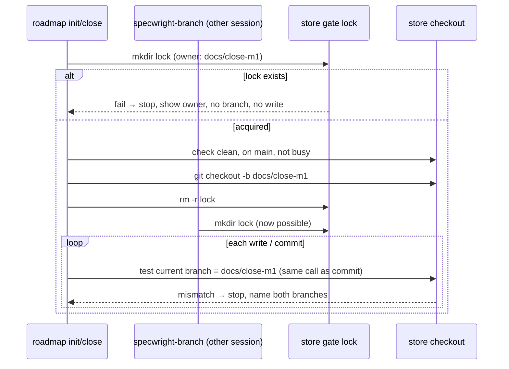
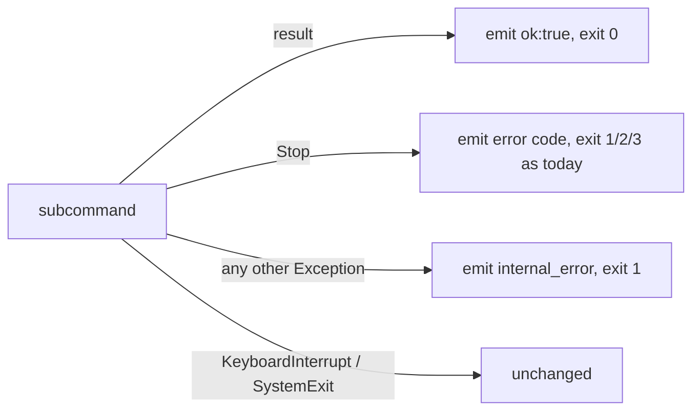

# Design

## Triage

| Trigger | Applies? | Evidence |
|---|---|---|
| T1 Components (new component, or 3+ with directed relationships) | No | One small bundled script (`fit-subject.sh`) called only by `specwright-commit`; every other edit changes existing skills, agents and docs. |
| T2 State (persistent state, caches, 3+ state machine) | No | No new stored state. The ADR status (`proposed` → `accepted`) has two states and already exists in `openspec/architecture.md:82`. |
| T3 Concurrency (background work, workers/isolates, async, retries) | Yes | Roadmap store branching joins the cross-session store gate lock (`skills/specwright-branch/SKILL.md`, Store-backed changes step 1). |
| T4 Boundaries (data format, migration, shared interface, IPC, external) | Yes | `pr-pair.sh` JSON error contract gains `internal_error` (`skills/specwright-pr/scripts/pr-pair.sh:30-31`); agent definitions and packets are an interface between orchestrator and agents. |
| T5 Volume (grows without a fixed bound) | No | Nothing new grows. |
| T6 Risk (security, money, data loss, unrecoverable user data) | Yes | Task text containing shell syntax flows into a commit command (#21). |

TIER: FULL

## Context

See proposal.md for the issues. Current state:

- Claude agents list `tools: Read, Grep, Glob, Edit, Write, Bash` (implementer) and `Read, Grep, Glob, Bash, Write` (reviewer), with no `Skill` (`agents/claude/specwright-implementer.md:5`, `agents/claude/specwright-reviewer.md:5`). Claude Code docs (sub-agents, "Preload skills into subagents") confirm that a subagent with `Skill` in `tools` can invoke project, user and plugin skills during execution. Omitting it is what blocks them. OMP agents already have `read` (`agents/omp/*.md:5`), and OMP reads skills from `.claude/skills/` (README Step 2).
- The apply packet is defined in the schema's DELEGATION paragraph (`schemas/specwright/schema.yaml:429-437`). The design review hands the reviewer file paths (`:308`).
- The subject rule is prose only (`skills/specwright-commit/SKILL.md:27`), and agents miscount backticks (#21). The skill's `allowed-tools` are `Bash(git *) Bash(openspec *)` (`:7`). The existing eval grader measures real subjects with `len` (`evals/git-workflow/grade.py:218-219`).
- Roadmap "Committing project files" branches with a plain `git checkout -b` and no lock or per-write check (`skills/specwright-roadmap/SKILL.md:30`). Init step 5 caps the review at "at most two rounds" (`:40`). Next step 3 edits the roadmap on main (`:51`). The architecture already describes ADRs as `proposed` until their gate (`openspec/architecture.md:82`). Only the skill is wrong.
- `pr-pair.sh` writes with `Path.write_text(..., newline="\n")`, which exists only on Python 3.10+ (`:932`), and catches only `Stop` (`:1220`). The README prerequisites omit Python (`README.md:42`), and `specwright-pr` says the scripts "need only `gh`" (`skills/specwright-pr/SKILL.md:10`).
- Skill-text checks by position already exist (`evals/pr-pair/test_skill_text.py`), as do agent evals with fixtures (`evals/git-workflow/`).

## Decisions

### D1: Skills reach agents through the harness's own loader, named in the packet (#24)

- **Choice:** Add `Skill` to both Claude agent `tools:` lists. The DELEGATION packet and every review request (design review, baseline review) get one more item: the installed project skills relevant to the work, each by name with the path of its installed `SKILL.md` as the orchestrator resolved it (project or user level), or `none`. Agent bodies say:
  - load each named skill before working (Claude: `Skill` by name; OMP: `read` of the given path);
  - load only the skills the packet or request names, and never invoke a Specwright workflow skill (`specwright-*`): their descriptions say "MANDATORY during apply", and `specwright-commit` would commit;
  - report any named skill that could not be loaded;
  - nothing a skill says changes who verifies, ticks or commits. The restart note goes into README Step 8 and CONTRIBUTING setup step 4 (both already mention restarting) and says agent definitions too.
- **Rejected:** a static `skills:` preload list in the agent frontmatter. The definitions are shipped and overwritten on update (#24), so a per-project list cannot live there, and preloading every possibly relevant skill bloats every dispatch.
- **Reversal cost:** low. Text in definitions and the schema; no stored format.

### D2: A bundled bash + awk script fits the subject in the message file (#21)

- **Choice:** New `skills/specwright-commit/scripts/fit-subject.sh <msgfile>`. The agent writes the full message, with the untruncated subject on line 1, to a temp file. The script:
  - leaves line 1 as is when it is 72 characters or fewer;
  - otherwise keeps the `<type>(<scope>): task X.Y ` prefix (regex `^[^ ]+: task [0-9]+\.[0-9]+ `) plus the longest run of whole words that fits, rewrites line 1 in place, and keeps every other line byte for byte;
  - prints the final subject;
  - exits 1 without touching the file when not even the first word fits, and exits 2 on a missing file or a line 1 that has no task prefix.

  The agent then runs `git commit -F <msgfile>`. A store-backed pair reuses the same file, so both commits carry the identical subject. Task text never appears on a command line, only in the file the agent wrote with its file tool, so shell syntax in it is never evaluated. `allowed-tools` stays unchanged: a broad `Bash(bash *)` would also pre-approve `bash -c '<anything>'`, so the script call is prompted like other non-git commands.
- **Rejected:** a Python one-liner. It would make Python a core dependency for `finish: local` users, who today need only bash and git, and would still need the task text passed safely. **Also rejected:** better prose ("count backticks"), which is what fails today.
- **Reversal cost:** low. Internal to the skill; the subject format (`openspec/architecture.md:90`) is unchanged.

### D3: Roadmap store branching reuses the branch skill's gate procedure (#43)

- **Choice:** Store-backed "Committing project files" runs `specwright-branch`'s Store-backed steps 1, 2 and 4 on the store: take the lock with `change: <branch-name>` in `owner`, check the store is clean on its main and not busy, create the branch, release the lock. It then starts every store write step with `test "$(git -C "<store toplevel>" branch --show-current)" = <branch>`, and every store commit with `cd "<store toplevel>" && test "$(git branch --show-current)" = <branch> && git add -- <files> && git commit ...` in one call. A mismatch stops and names both branches. Which repo holds each project file is unchanged (#52 is out of scope).
- **Rejected:** a second lock file for roadmap. Two locks would let a roadmap branch and a change branch pass their gates together on the same store.
- **Reversal cost:** low.

### D4: ADRs are accepted when their review gate passes; immutable once on main (#44)

- **Choice:** Init step 4 and close step 5 write ADRs as `Status: proposed`. When the baseline review gate passes (D5), the orchestrator sets `Status: accepted` with that date, adds them to the in-force index (accepted ADRs only) and only then writes the roadmap, all in the branch's commit. The acceptance edit (a reviewed ADR's `Status: proposed` → `accepted` with its date, plus that ADR's row in the in-force index) is part of passing the gate and does not void the verdict. Any other edit does. An accepted ADR that is not yet on main (a PR fix round on `docs/project-baseline`) may still be edited, but the edit voids the review (D5). Once on main it is never edited. Close's superseding ADR gets the same review (init step 5 procedure, a new round in `openspec/architecture-review.md`) before acceptance, and the superseded file is not touched.
- **Rejected:** accept at PR-ready time in `specwright-pr` watch. It needs project-file-specific hooks in the PR skill and leaves a local-finish path with no acceptance point.
- **Reversal cost:** low. Status lines in markdown files.

### D5: Baseline review rounds use the schema's rule (#49)

- **Choice:** Init step 5 drops "at most two rounds" and points to the schema review rule (`schemas/specwright/schema.yaml:335-347`): escalate after 2 consecutive REVISE; any edit after a pass voids it and needs a new round, except the acceptance edit defined in D4. `specwright-pr` feedback gets one rule: on a `docs/project-baseline` or `docs/close-*` branch, a fix that edits the strategy, architecture or an ADR voids the baseline verdict, so rerun the roadmap baseline review before replying that the fix is done. `openspec/architecture.md:107` (Design review row) states the new rule.
- **Rejected:** keep a cap and reset it after each pass. That is a second counter the schema does not have.
- **Reversal cost:** low.

### D6: The gap-closing roadmap entry is committed on the new change's branch (#50)

- **Choice:** Next step 3 proposes the gap-closing change without editing any file. Step 4 starts `/opsx:propose <change-name>`. As soon as `specwright-branch` has created the branch, roadmap adds the change to the current milestone's Changes and commits only the roadmap file by name: `docs(<change-name>): add <change-name> to the roadmap` (store-backed: in the repo that holds the roadmap file, with D3's branch check). Propose then continues. If the gate stops, nothing was edited. The entry merges with the change.
- **Rejected:** a separate `docs/roadmap-<change-name>` branch finished before the gate. In pr mode it means waiting for a merge before the change can start, and it adds a branch, PR and resume path for a one-line edit.
- **Reversal cost:** low.

### D7: Python 3.8-safe write and a catch-all JSON error (#46)

- **Choice:** Replace `tmp.write_text(..., newline="\n")` with `with open(tmp, "w", encoding="utf-8", newline="\n") as f: f.write(...)`, then the existing `os.replace`. After the existing `except Stop`, add `except Exception as e: emit({"ok": False, "error": "internal_error", "message": f"{type(e).__name__}: {e}"}, 1)`. `KeyboardInterrupt` and `SystemExit` are not `Exception`, so they still behave as before. Exit 1 matches "stop (the JSON has error and message)" in the header (`:30`).
- **Rejected:** raise the minimum to 3.10. The baseline (strategy, ADR 0002) states 3.8+, and the fix is one line.
- **Reversal cost:** low. `internal_error` becomes a documented error code; callers already treat any `ok: false` as a stop.

### D8: Prerequisites split into core and PR-only, checked at install (#45)

- **Choice:**
  - README prerequisites list `git` and `bash` with a POSIX userland (Git Bash on Windows) as core: `fit-subject.sh` (D2) and the skills' shell checks need them. `gh` 2.40+ and Python 3.8+ are listed as PR-skill requirements.
  - Install Step 1 checks git and `bash -c 'command -v awk sed grep'`: a failure stops the install.
  - It also checks `gh --version` ≥ 2.40, and `python3`, then `python`, with the same probe as `pr-pair.sh:35-37`. A failure is recorded and reported in Step 8 as `PR workflow not ready: <missing>`. It does not block the install or the `VERSION` stamp.
  - `specwright-pr` line 10 and the `pr-pair.sh` header name bash, git, gh 2.40+ and Python 3.8+.
- **Rejected:** block the install on PR prerequisites. `finish: local` users would be blocked by tools they never run.
- **Reversal cost:** low.

## Diagrams (FULL)

T3: roadmap store branching under the shared gate lock (D3).

T4: `pr-pair.sh` dispatcher outcomes (D7).

## State & Ownership (FULL)

| State | Owner (sole writer) | Lifetime | Invalidation / rebuild | Authoritative copy |
|---|---|---|---|---|
| Store gate lock (`<common-dir>/specwright-gate.lock`) | Whichever gate holds it: `specwright-branch`, or roadmap init/close (new) | From `mkdir` until its branch exists or it stops | Never removed automatically; a stale lock is removed only after the user confirms (existing rule) | The lock directory and its `owner` file |
| ADR `Status:` line | Roadmap init/close before main; nobody once on main | Project lifetime | `proposed` → `accepted` at gate pass; superseded by a new ADR, never edited | Main of the repo holding `project.adr_dir` |
| Baseline review verdict | The reviewer (`openspec/architecture-review.md`) | Until any reviewed file changes | Any edit to strategy, architecture or ADRs voids it | The review file on the branch |
| Commit message temp file | `specwright-commit`, one task at a time | One task's commit or commit pair | Rewritten per task | The file; git copies it |

## Failure & Visibility (FULL)

| Component | Fails / dies mid-operation → | Recovery | Retry safe? | Who finds out |
|---|---|---|---|---|
| `fit-subject.sh` | Unfittable subject → exit 1, file untouched; missing file or malformed line 1 → exit 2 | The agent reports the task, the subject and the limit and makes no commit (spec) | Yes: it only rewrites line 1 after computing it | The user, from the agent's report |
| Roadmap store gate | Dies holding the lock | The existing stale-lock rule: user confirms, then removal | Yes, after removal | Next gate run shows the owner |
| Roadmap store write | Store switched by another session | Stop before further writes; files already written stay on whatever branch is checked out (same limit as `specwright-branch`) | Yes, after the user restores the branch | The user, from the stop message naming both branches |
| `pr-pair.sh pass write` | Unexpected exception → `internal_error` JSON; interrupted mid-write → only the `.tmp` file exists, never a partial record | `specwright-pr` stops on `ok: false` as for any error | Yes: the record is replaced atomically | The orchestrator, then the user |
| Gap-closing roadmap commit | Branch gate stops → no edit made; commit fails → the roadmap file is dirty on the change branch | The user resolves it; the next `specwright-commit` sees an unexpected file and asks (existing rule) | Yes | The user |

## Resource Bounds (FULL)

| Queue / buffer / cache / transfer | Bound | At the bound | Timeout | At 10x / 100x |
|---|---|---|---|---|
| Commit subject | 72 characters | Cut at the last fitting word; exit 1 if none fits | — | Fixed |
| Baseline review rounds | 2 consecutive REVISE | Escalate to the user (USER_OVERRIDE) | — | No lifetime cap: each round needs a real edit or a REVISE, so rounds track user-visible work |
| Lock hold time | One gate run | — | None (as in `specwright-branch`) | Unchanged |

## Flow & State Gaps (FULL)

- **Partial completion (roadmap):** a stop after branching but before commit leaves the branch and any written files. Re-running init or close finds its branch existing; the existing branch rules apply (the branch gate's step 7 offers resume).
- **Concurrent sessions:** the lock serialises only branch creation. Another session can still switch the store checkout later, so per-write checks (D3) turn a wrong-branch write into a stop. A write that lands between a check and the file tool's write is possible. The commit-time check catches it before it is committed, the same limit `specwright-branch` documents.
- **Stale verdict:** an edit to baseline files after a pass, including in PR feedback, voids it (D5). The PR rule makes the feedback flow re-run the review.
- **Restart mid-commit:** the message temp file is rewritten per task. A crash between fitting and committing just re-runs the fit, which is idempotent on a line that already fits.
- **Non-UTF-8 locale:** awk may count bytes instead of characters. That can cut one word earlier for non-ASCII text but never exceeds 72 characters.

## Mechanism Ledger (FULL)

| Mechanism | Built? | Why (harm nobody catches / expensive later) | Evidence that would change the call |
|---|---|---|---|
| `fit-subject.sh` | Yes | Prose counting fails repeatedly (#21) and amending is forbidden, so long subjects stay in history | — |
| Preflight of all subjects before work starts | No | An unfittable subject only happens with change names near 60 characters; it stops one commit, and the user renames or amends | A real change name that hits it |
| Branch check before store writes and in each store commit call | Yes | A wrong-branch commit in a shared store is silent (#43) | — |
| Always-run source check: the embedded Python passes no `newline=` to `write_text`/`read_text` | Yes | Runs on every machine, so the 3.10-only call cannot come back unnoticed when no 3.8 is installed | — |
| Python 3.8 test via a real 3.8 interpreter | Yes, skipped when none found (second layer) | The defect is version-specific; a modern interpreter cannot show it | — |
| CI on Python 3.8 | No | Out of scope (no CI in this repo yet) | CI being added |
| Revert ADR to `proposed` before PR edits | No | Immutability starts on main (#44); D5 already forces re-review | A reviewer approving an ADR edit without re-review |
| Separate docs branch for gap-closing roadmap edit | No | D6 avoids it | — |

## Risks / Trade-offs

- [Claude subagent `Skill` use not observed in a fresh session yet] → The M1 exit criterion is user-verified. The README Evals section gets a short probe (dispatch the implementer with a named skill and look for the `Skill` call).
- [bash/awk differences (BSD awk on macOS)] → The script uses only POSIX awk (`length`, `split`, `substr`). The unit tests run it through `bash` from Python.
- [`message` in `internal_error` could carry a path] → Paths are not secrets. Tokens never enter exceptions here: `gh` errors go through their own handling.
- [Text-position checks are weaker than agent evals] → Agent evals are used for the branch-state and stop paths (#43 lock held, #50 gap and dirty main), per CONTRIBUTING Testing. Text checks cover prose-only rules.

## ADRs

- **In force, constraining this change:** 0002 (agent instructions with thin scripts: `fit-subject.sh` stays a thin script), 0003 (git as state: no new state store), 0005 (orchestrator owns verification and commits, kept by D1), 0006 (store branch checks, extended by D3).
- **To record during apply:** none.
