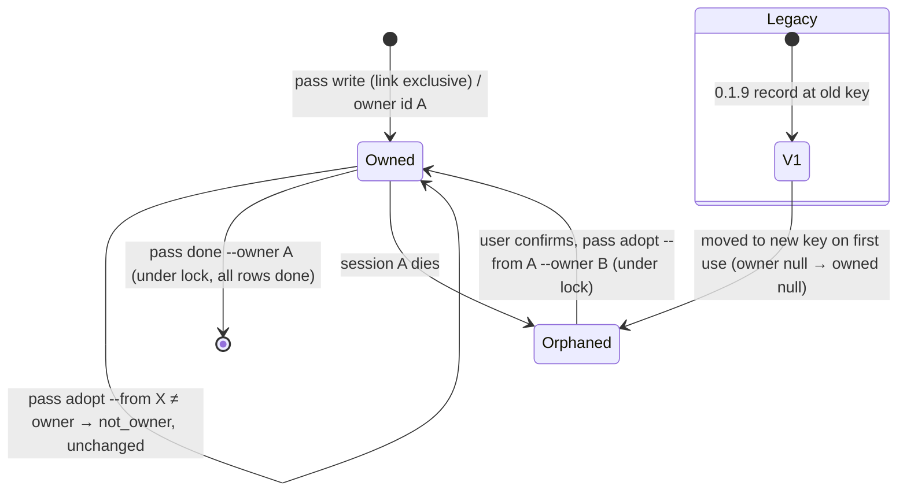
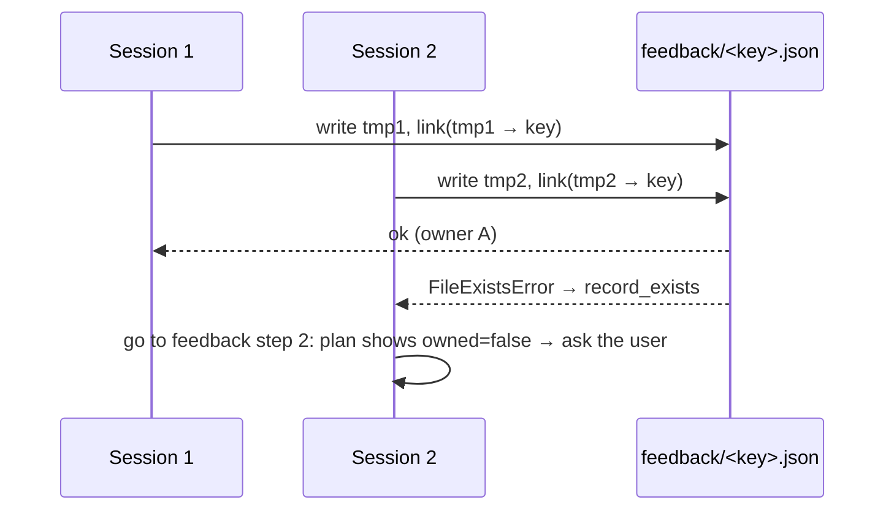
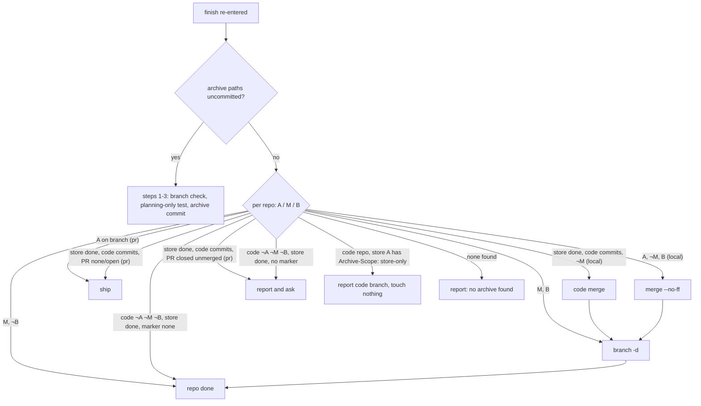

# Design

## Triage

| Trigger | Applies? | Evidence |
|---|---|---|
| T1 Components (new component, or 3+ with directed relationships) | No | No new component. New subcommands (`pass adopt`, `closing-check`, `closed-check`) live in the existing `pr-pair.sh`; finish resume is skill text. |
| T2 State (persistent state, caches, 3+ state machine) | Yes | The pass record (`pr-pair.sh:830-936`) gains an owner, a new key and a version. The finish resume reads a per-repo state machine (archive committed → merged → branch deleted). |
| T3 Concurrency (background work, workers/isolates, async, retries) | Yes | Two sessions writing one pass record (#32); the check-then-replace in `pass_write` (`pr-pair.sh:897-935`). |
| T4 Boundaries (data format, migration, shared interface, IPC, external) | Yes | The record file format and path change (migration from the 0.1.9 key). `pr-pair.sh`'s JSON output is a contract (ADR 0002). It gains `rounds`/`pass` without `--store`, the `link` row, the `react` row semantics and new subcommands. The new GitHub reads are `closingIssuesReferences`, the PR's base and state, and each intended issue's state and close history; the new GitHub write is closing an issue with a comment at cleanup (D10). |
| T5 Volume (grows without a fixed bound) | Yes | Reaction lists and closing-issue lists read from GitHub are unbounded on GitHub's side. |
| T6 Risk (security, money, data loss, unrecoverable user data) | Yes | A wrongly removed or taken-over record loses a pass's intent (#32). A wrongly repeated finish step could merge or delete the wrong branch (#48). |

TIER: FULL

## Context

See proposal.md for the issues. Current state:

- **Pass record.** `record_path` joins owner, name and change with `-` after replacing other characters with `_` (`pr-pair.sh:830-834`), so `acme-tools/widget` and `acme/tools-widget` collide. `pass_write` checks `path.exists()` (`:898`), validates, then writes `<path>.json.tmp` and replaces it with `os.replace` (`:931-935`). The check and the publish are separate, and the temp name is shared. `pass_done` re-plans and unlinks with no owner check (`:1165-1172`). The intent check covers only the presence of `branch`, `round`, `prs` and `findings` (`:894-896`); `pass_plan` then calls `prs.get` (`:1005`, `:1016`).
- **Reactions.** The react row is `rerun` once the reply is answered (`:1154`), and `rerun` counts as done (`:1157`). The snapshot only tells whether this account reacted to items it still lists (`pr-snapshot.sh:110-111`, `reacted` on thread comments, `:159`). An answered, resolved thread is not listed at all.
- **Rounds.** `rounds = max(trailers, subject counts)` (`:808`). The `partial_commit` path makes a second commit with the same trailer (`:1048-1050`).
- **Adopted code PR.** `pass_plan` adds a newly discovered open code PR to `prs` (`:1060-1063`). No row checks the pair links. `cmd_link` already skips a PR whose body or marker names the peer (`:649-659`).
- **Repo-local.** `specwright-pr` says `pass` and `rounds` are store-backed only (`SKILL.md:65`), and repo-local rounds are read from `git log` by the agent (`SKILL.md:91`). `pass_args` requires `--store` (`:882`).
- **Finish.** `specwright-finish` step 1 reports `Nothing to finish` on main when no archive changes are uncommitted (`SKILL.md:17`). Step 3 commits the archive unconditionally (`:26`). Local store-backed finish merges the store, then the code repo (`:32-36`).
- **PR descriptions.** `references/description.md:32` says `Fixes #N` but not one keyword per issue. Ship step 4.3 runs `ensure-pr` and nothing checks what GitHub will close (`SKILL.md:75`).
- **ADRs.** ADR 0003: the pass record is local working state that "can be rebuilt or safely asked about". Ownership by asking fits it. ADR 0002: mechanical work goes into scripts with a JSON contract, so the closing-reference check and the ownership rules go into `pr-pair.sh`, not prose. ADR 0006: store-backed changes pair two repos, and repo-local reuse of the pass machinery keeps one code path.

## Decisions

### D1: Exclusive creation plus an owner id for the pass record (#32)

- **Choice:**
  - `pass write` builds the record in a uniquely named temp file in the record's directory, then publishes it with `os.link(tmp, path)`. That call fails with `FileExistsError` if any record exists, so creation is exclusive and the published file is always complete. The temp file is removed either way.
  - Where hard links are unsupported (an `OSError` other than `FileExistsError`), it falls back to `os.open(path, O_CREAT | O_EXCL | O_WRONLY)` and writes there. That is still exclusive, but a crash mid-write leaves an unreadable record, which reports `record_unreadable`.
  - The record (`version: 2`) holds `owner: {id, at, checkout, host}`. `id` is a random 128-bit hex string generated by `pass write` and returned in its output. `at` is UTC ISO time.
  - `pass plan --owner <id>` reports `owner` and `owned` (`true`, `false`, or `null` for a record with no owner, i.e. version 1). It never refuses: plan only reads.
  - `pass done --owner <id>` and the new `pass adopt --owner <new id> --from <id shown|none>` change the record under a lock directory `<record>.lock`, created with `os.mkdir` and removed in `finally`; a removal that fails never replaces the outcome of the work under the lock, which is printed with `lock_left: [<lock path>]`. Under the lock they re-read the record:
    - `done` refuses with `not_owner` unless the owner ids match;
    - `adopt` refuses with `not_owner` unless the record's owner equals `--from`, then writes the new owner through a temp file and `os.replace`.
  - A held lock refuses with `record_busy` and names the lock path, and the lock is never removed automatically. Ownership is never transferred without the user. The skill asks and passes `--from` with the id it showed.
- **Rejected: a lease with heartbeat and expiry.** It would allow automatic takeover, but agent sessions stall for minutes on tool calls, and an expired lease taken over while the first session is still alive is the #32 failure. It also contradicts the store-gate convention ("never auto-remove; ask"). **Rejected: an `mkdir` lock beside the record as the ownership mechanism.** The lock would be a second state file that must agree with the record. Here the record itself is the exclusive object, and the lock only serialises the short read-check-write of `adopt` and `done`.
- **Reversal cost:** medium. The record format is local working state (ADR 0003), but the `--owner` flags and `owned` field are part of the script contract the skill reads.

### D2: Collision-free record key with a guarded move from the 0.1.9 key (#32)

- **Choice:**
  - The key is `<readable>-<h>.json`:
    - `<readable>` is the old sanitised `owner.name.change`, kept for humans with `.` as the separator, cut to its first 120 characters, so the name and its `.lock` stay far below the 255-character file-name limit (GitHub allows 39 + 100 characters for owner and name alone);
    - `<h>` is the first 32 hex characters of `sha256(lower(owner) + "\n" + lower(name) + "\n" + change)`.
  - The hash keeps the fields apart, so different identities never share a file. Lower-casing matches GitHub's case-insensitive names.
  - On every `pass` call, if the 0.1.9 path exists, it is read. When the new path is absent and the old file cannot be parsed or cannot be read (any OS error, such as a denied permission), its identity is unknown, so the lookup stops with `record_unreadable`; when the new path exists, an unreadable old file is reported as ignored and never blocks the valid record. A readable old file byte-identical to the new record is the leftover of an interrupted move and is removed. Otherwise, with the new path absent, when its `code_repo` (compared case-insensitively) and `change` equal the lookup, it is moved with `os.link` plus `unlink` under the same exclusive rule as D1. The move runs outside the record lock, so another caller can finish it first: an old file already gone at `unlink` counts as moved. An old path the OS rejects as too long counts as absent. Otherwise it is left alone and the lookup reports no record.
- **Rejected: percent-encoding each field with a separator.** It is equally collision-free and fully readable, but filenames grow and still depend on the encoding being applied consistently by hand. The hash suffix is fixed length. **Rejected: no migration.** A pass interrupted under 0.1.9 would silently vanish and the next run would start a fresh pass at a higher round.
- **Reversal cost:** low. It is a local cache path.

### D3: Full intent validation in `pass write` (#26)

- **Choice:** Before anything is written, check:
  - `branch` is a non-empty `str`;
  - `round` is an `int`, not a `bool`, and ≥ 1;
  - `prs` is a `dict` with keys only from `code`/`store`, each `None` or a `dict` with `repo` matching `^[^/\s]+/[^/\s]+$` and `number` an `int` (not a bool) ≥ 1;
  - repo-local (D6): `prs.store` must be absent or null;
  - per finding: for `kind: thread` (the default), `root_id` is an `int` (not a bool) ≥ 1, because D4 reads the thread's reaction through it; for `comment` and `review` findings, `item` is a non-empty string.

  The error names the offending key (`invalid_intent`, exit 2, as today).
- **Rejected: validate lazily in `pass plan`.** The record would already exist and block every later pass, which is the bug.
- **Reversal cost:** low.

### D4: Reactions are confirmed from GitHub; `rerun` is removed (#25)

- **Choice:**
  - Once a finding's reply is answered, `pass plan` reads the reactions on the recorded target with the repo's login:
    - a thread root's numeric review-comment id → `repos/<repo>/pulls/comments/<id>/reactions` (paginated);
    - a node id (comment or review) → GraphQL `node(id:) { ... on Reactable { reactions(first: 100, content: THUMBS_UP|THUMBS_DOWN, after:) { nodes { user { login } } pageInfo } } }`, paged.
  - The row is `done` when a reaction of the recorded content by the snapshot's `viewer` exists, and `todo` otherwise.
  - A failed read exits 3 (unknown), as for every other GitHub read in the plan.
  - The skill runs `todo` react rows with `pr-reply.sh react`, which is idempotent on GitHub, then plans again.
- **Rejected: count `rerun` as `todo` without evidence.** The pass could then never complete, because nothing would ever mark it done. **Rejected: read reactions from the snapshot.** An answered and resolved thread is not in the snapshot (`pr-snapshot.sh:148`), so the evidence is missing exactly when it is needed.
- **Reversal cost:** low. It is one row's state source; the output field names stay.

### D5: Legacy subject count only without trailers (#29)

- **Choice:** In `rounds`, `rounds = max_trailer` across repos when any repo has a trailer, else the maximum `subject_count`. The output fields stay.
- **Rejected: count distinct trailer values.** That differs from the spec's "highest n" and from how `pass` names rounds.
- **Reversal cost:** low.

### D6: Repo-local changes use the same pass, plan and rounds (#34)

- **Choice:** `--store` becomes optional for `pass write|plan|done|adopt` and `rounds`.
  - Without it, the only repo is `code`.
  - Every finding's `source` and `destination` must be `code` (otherwise `misrouted`), and no marker is looked up.
  - The plan builds rows for `code` only.
  - `rounds` reads only the code branch.
  - `specwright-pr` feedback steps 2, 3, 6 and 10 then apply to repo-local changes too, and the "store-backed only" list in "The repos and PRs of a change" shrinks to `expected`, `pair-state` and `cleanup-plan`.
- **Rejected: infer a repo-local pass from the trailer commit.** The commit does not say which findings it fixed or what disposition each got, so replies would be re-judged from scratch, which is #34's failure.
- **Reversal cost:** low. It is additive to the script contract.

### D7: A `link` row for a code PR the plan adopts (#30)

- **Choice:**
  - When the record's `prs` has a store PR and no code PR, and the plan adopts an open code PR (`pr-pair.sh:1060-1063`), it adds `{"step": "link", "state": ..., "code": {"repo", "number", "url"}, "store": {"repo", "number", "url"}}`.
  - Each `url` is GitHub's canonical `html_url`, read from `repos/<repo>/pulls/<n>` through that repo's login. It is never built from the record's slug, because `cmd_link` matches URLs exactly and case-sensitively (`:649`, `:658`).
  - The state is `done` when each PR names the other's canonical URL in its body or in a `specwright:link` marker of the right kind, and `todo` otherwise. This is the same test `cmd_link` uses to skip (`:649-659`), factored into one function both use with those URLs.
  - The skill runs ship step 5 for a `todo` row, passing exactly the row's `code.url` and `store.url` as `--peer-url` to the two `link` calls, then plans again.
  - Before any code changes, a regression test reproduces the interruption (code PR opened, links missing, fix pushed, replies done) and shows the plan reporting `complete`.
- **Rejected: always re-run ship from the feedback pass.** Ship also pushes, validates and posts requests. The pass needs only the link evidence.
- **Reversal cost:** low.

### D8: Finish resumes from per-repo git evidence (#48)

- **Choice:** A new **Resume** section at the top of `specwright-finish`. It applies when the change directory is gone and the user asks to finish (or the archive workflow reports the change already archived). For each repo of the change (repo-local: one; store-backed: the store, then the code repo), read three facts:
  - **A:** an `archive change` commit for the change on `<branch>` (`git log --format=%s <main>..<branch>`, a subject `<type>(<change-name>): archive change`), or on main;
  - **M:** `merge: <change-name>` in `git log --first-parent --format=%s <main>`, and, when B, the branch tip is on main (`git merge-base --is-ancestor <branch> <main>`). An archive-recovery branch made after the change merged holds a new archive commit, so the earlier merge does not count for it;
  - **B:** `<branch>` exists.

  Then continue from the first missing step of the normal order. Rows are checked top to bottom, and the first match wins:

  | Case | Next step |
  |---|---|
  | uncommitted archive paths, no A | steps 1-3 in order (branch check and recovery branch, planning-only test, archive commit) |
  | A on branch, not M, B, local mode | merge |
  | code repo, store's A has `Archive-Scope: store-only` | out of scope: report its branch and PR state, touch nothing; counts as done for `Nothing to finish` |
  | M and B | `git checkout <main> && git branch -d` |
  | M, not B | repo done |
  | code repo without A, M, B; store done; store archive marked `code_changes: none` | code repo done |
  | code repo without A, M, B; store done; no such marker | report and ask |
  | store done, code branch with commits, code not M, local mode | code merge |
  | store done, code branch without commits | `git checkout <main> && git branch -d` |
  | pr mode, A on branch, PR not merged | step 4 pr (ship; push and PR are idempotent) |
  | pr mode, the branch's PR merged | **After the PR is merged** (cleanup), not ship |
  | pr mode, store done, code branch with commits, code not M, no PR or an open PR | `## pr` ship for the code branch (push and PR are idempotent: it opens the PR or reports the open one); merge nothing, delete nothing |
  | pr mode, store done, code branch with commits, its PR closed unmerged | report the closed PR and ask; merge nothing, delete nothing |

  - **Finding the branch from main:** `<prefix>/<change-name>` with the prefix rule of `specwright-branch` step 6; else a local `chore/archive-<change-name>`; else the one local branch matching `*/<change-name>`. Several candidates → list them and ask.
  - **The archive subject** matches any type: the regex `^[a-z]+\(<change-name>\): archive change$`.
  - `Nothing to finish` is reported only when every repo is done.
  - Uncommitted changes under the archive directory or the change directory stop the resume, listed for the user.
  - When none of the facts is found, finish reports that it found no archive of the change and does nothing.
  - The planning-only test (step 2) runs only before an archive commit: a resume that finds archive paths uncommitted and no A runs it, then the archive commit; once A exists, a resume never writes the marker.
  - **Store-only archive recovery** (step 1 on main: the recovery branch `chore/archive-<change-name>` is created in the store only): step 3 writes the body line `Archive-Scope: store-only` into the archive commit message when the change is store-backed and the store is on `chore/archive-<change-name>` (true on a first run and on a resume alike). Resume reads it from the newest store A: `git log -1 --format=%B <A>`, matching the exact line. When it is there, the code repo is out of scope for the resume: no code merge, ship or branch deletion; the resume reports the code branch's state and leaves it to its own PR or finish.
  - **Planning-only, already finished:** a local finish of a planning-only change deletes the empty code branch and makes no code merge, so the code repo shows no A, M or B. The marker's path comes from the store's A: `git show --name-only --format= <A>` lists `
/changes/archive/<archived-name>/specwright-change.yaml` when one was written; `git show <main>:<that path>` must match `^code_changes:\s*none\s*$` (the test `find_marker` uses). When the store is done and that holds, the code repo is done. Without that marker, a code repo with no A, M or B beside a finished store is reported and the user is asked.
  - Every branch deletion checks out `<main>` first: a resume can start on the branch it deletes, and git refuses to delete the checked-out branch.
- **Rejected: a finish progress file.** That is a second source of truth (ADR 0003), and git already holds every fact.
- **Reversal cost:** low. It is skill text.

### D9: One closing keyword per issue, checked by `closing-check` (#61 parts 1-2)

- **Choice:**
  - `references/description.md`: one `Fixes #N` line per fully resolved issue; `Related: #N` otherwise. In a store-backed change, closing lines go on the PR in the repository that holds the issues (normally the code PR), and the store PR uses `Related: <owner>/<repo>#N`. When no PR is expected in the repository that holds an issue (a planning-only store-backed change whose issues are in the code repo), the PR that does exist carries the closing line in cross-repository form, `Fixes <owner>/<repo>#N`.
  - New `pr-pair.sh closing-check --repo o/n --pr N` reads, in one `gh api graphql` call (no newer `gh` than 2.40 needed): the PR body, its `baseRefName`, the repository's `defaultBranchRef`, and `closingIssuesReferences(first: 100)`. It then:
    - parses the intended issues, skipping code and hidden text: every reference directly after a closing keyword (`close[sd]?`, `fix(e[sd])?`, `resolve[sd]?`, case-insensitive, optional `:`), plus the closing list of a line that starts with one (`#N`, `owner/repo#N` or an issue URL). The closing list starts at the reference directly after the line's leading keyword (only whitespace and the optional `:` between them; a `,`, `;`, `and`, another keyword or a removed code span there means no closing list) and continues with each next reference separated from the one before by only `,`, `;`, `and`, whitespace or another closing keyword; any other text (such as `Related:`) ends it, so `Fixes #21; Related: #52` names only 21. A keyword-led line whose first reference does not directly follow the keyword (`Fixes the crash; Related: #52`) has no closing list. A later closing keyword on the line still names the reference directly after it;
    - normalises intended and linked issues alike to `owner/repo#N`, a bare `#N` taking the PR's own repository;
    - prints `{status, intended, linked, missing, extra, base, default_branch}`. `status` is `match` when `missing` is empty and `mismatch` otherwise. `extra` (issues linked by hand in the sidebar) is informational and never makes a mismatch.
    - When the base is not the default branch, it prints `status: not_default_base` with the intended issues. GitHub applies closing keywords only on PRs into the default branch.
  - The closing list is bounded at 100. `hasNextPage` true → exit 3 (unknown), as is any lookup failure.
  - Ship step 4.3 runs it after `ensure-pr`:
    - `not_default_base` → no rewrite and no stop: ship reports that GitHub will not close the listed issues from this PR;
    - `created` + mismatch → rewrite only the closing lines that hold nothing but a keyword and references, one keyword per reference. A closing line with other text is left as is and reported. Then `gh pr edit --body-file` and check again; a second mismatch → stop and name the missing issues;
    - `found` + mismatch → report and ask; never edit the description unprompted.
  - Code and hidden text are skipped as GitHub renders them (CommonMark): fenced blocks, closed only by a fence line of the same character, at least as long, with nothing but white space after it; indented code: every line indented four or more columns (a tab advances to the next multiple of four) unless the line before it is a paragraph line, that is non-blank text other than a heading, a fence line, a thematic break or an HTML-comment line; the first line of the description counts as following a blank line. Lists get no exception: an indented list paragraph skipped this way only makes its reference count as `extra`; HTML comments (`<!-- ... -->`, also across lines; a comment that starts its own line is an HTML block and takes the rest of its closing line, while the text after an inline comment's `-->` is read); and code spans, which may continue across the lines of one paragraph. A span opens at a backtick run and closes only at the next run of the same length, so ` ``Fixes #21`` ` is code; a run with no matching closer is literal text. A removed span leaves a space, so the text around it never joins into a new word (`` Fi`x`xes #52 `` is not `Fixes #52`). Within a paragraph, code spans are found before HTML comments: a `<!--` inside a span is code, not the start of a comment (a line that starts with `<!--` is an HTML block, not a paragraph). Erring toward skipping is safe: a reference wrongly skipped is reported as `extra` or left for a person, while one wrongly counted would be closed at cleanup. An ordered-list marker (`1.`, `1)`) before a keyword counts as the start of the line, like `-`, `*` and `>`. The block rules (fences, indented code, HTML blocks, headings) read each line after its blockquote and list markers, as CommonMark does inside a quote, so `>     Fixes #52` is indented code; list markers are read past the same way, so `- ~~~` opens a fence inside a list item, and a list item whose marker is followed by five spaces starts indented code.
- **Rejected: a prose rule alone.** PR #59 was written with a prose rule in place.
- **Reversal cost:** low.

### D10: Issues a merged PR left open are closed at cleanup (#61 part 3)

- **Choice:**
  - New `pr-pair.sh closed-check --repo o/n --pr N --repos o/n[,o/n] [--login o/n=L ...]` (`--repos`: the change's repositories; `--login`: the login that reads a repository other than the one the call runs as, such as a private store read by `planning_store.login`). One GraphQL read of the PR (`state`, `url`, `body`, `baseRefName`, the repository's `defaultBranchRef`) through the repo's login; the intended issues parsed by D9's function. Only intended issues in `--repos` (compared case-insensitively) are read, each through its repository's login: its `state` and the time of its last `ClosedEvent`. The PR read also returns `mergedAt`. Others are listed as `outside`, unread. It prints `{status, pr_url, base, default_branch, intended, open, reopened, closed, outside}`:
    - `status` is `not_merged` when the PR is not merged; `not_default_base` when its base is not the default branch (GitHub closes nothing from such a PR, and the fix has not reached the default branch); `merged` otherwise;
    - `open`: open, with no close at or after the PR's `mergedAt`; `reopened`: open, with its last close at or after the PR's `mergedAt`, so a person reopened it after the merge. A close and reopen before the merge (an earlier, partial fix) leaves the issue `open`, so cleanup still offers it.
  - A failed or malformed read of the PR, or of an issue it reads, exits 3 (unknown).
  - `specwright-pr` **Cleanup after merge** runs it for each merged PR of the change (store-backed and repo-local; `specwright-finish` **After the PR is merged** points there). Before closing, when any merged PR of the change has `open` issues, it lists them all with their PRs and asks the user one question for the change (the user may drop any); with none, it asks nothing: the parser approximates GitHub's renderer, so a person checks the list before an issue is closed. For each confirmed issue: `[as] gh issue close <n> --repo <owner/name> --comment "Fixed by <pr_url>. Its closing keyword did not close this issue on merge."`, with that repository's identity. Declined issues are reported as left open. `reopened` and `outside` issues are reported, never closed. `not_merged` → nothing. `not_default_base` → close nothing; report that the intended issues stay open until the fix reaches the default branch. Exit 3 → report the backstop as not done; branch cleanup continues. A failed close → report what was closed and what is still open, and continue; a later cleanup closes only the rest.
  - Only closing lines count, so a `Related:` issue is never closed.
- **Rejected: edit the PR description after merge.** GitHub applies closing keywords only at merge, so an edit closes nothing. **Rejected: close issues named anywhere in the body.** `Related:` issues are only partly resolved.
- **Reversal cost:** low. It is one script subcommand and one cleanup step.

## Diagrams (FULL)

Pass record ownership (T2, T3):

Two sessions starting a pass (T3):

Finish resume (T2):

Record format (T4): `{version: 2, owner: {id, at, checkout, host}, branch, round, prs, findings, change, code_repo, heads, marker}`. Version 1 lacks `owner`. `heads` has only `code` for a repo-local record.

## State & Ownership (FULL)

| State | Owner (sole writer) | Lifetime | Invalidation / rebuild | Authoritative copy |
|---|---|---|---|---|
| Pass record (`feedback/<key>.json`) | The session holding its owner id, through `pass write` (create), `pass adopt` (owner field), `pass done` (delete) | One feedback pass | Deleted at `pass done`; handed over only by `adopt` after the user confirms | The record file |
| Record lock (`<record>.lock`) | The `adopt` or `done` call that created it | One call | Removed in `finally`; a leftover is reported, never removed automatically | The directory |
| 0.1.9 record at the old key | Nobody after this change | Until first use | Moved once to the new key when identities match | The new key, after the move |
| Reaction evidence | GitHub | Permanent | — (read each plan) | GitHub |
| Finish progress | git (archive commit, merge commit, branch refs) | Permanent | — (read each run) | Each repo's refs |
| Closing references | GitHub's `closingIssuesReferences` | PR lifetime | Recomputed by GitHub when the body changes | GitHub |

## Failure & Visibility (FULL)

| Component | Fails / dies mid-operation → | Recovery | Retry safe? | Who finds out |
|---|---|---|---|---|
| `pass write` | Before link: no record; temp file removed or left in the feedback dir. After link: complete record | Rerun; a stray temp file is ignored (not the record name) | Yes | Agent (exit code) |
| `pass write` O_EXCL fallback | Partial record | `record_unreadable` stop names the path; the user removes it | After removal | User |
| `pass adopt` / `done` | Lock left behind | `record_busy` names the lock path; the user removes it after checking that no session is running | Yes, once removed | User |
| Reaction read | GitHub error | Exit 3, unknown; the plan is not reported complete | Yes | Agent → user |
| `link` row | Link call fails | The row stays `todo`; the pass does not complete | Yes (`link` is idempotent) | Agent |
| Finish resume | Stops between steps | The next resume reads the evidence again | Yes, by D8 | User (report) |
| `closing-check` | GitHub error or more than 100 closing issues | Exit 3; ship reports the check as not done | Yes | User (ship report) |
| `closed-check` | GitHub error on the PR or on an issue of the change's repositories | Exit 3; cleanup reports the backstop as not done, closes nothing and continues its branch cleanup | Yes | User (cleanup report) |
| Issue close at cleanup | `gh issue close` fails partway through the confirmed list | Cleanup reports which issues it closed and which are still open; a later cleanup reads the states again, asks about the rest and closes only those (a failed close leaves no close event) | Yes | User (cleanup report) |
| Issue reopened by a person after a close | — | `closed-check` lists it as `reopened` (its last close is at or after the merge); cleanup reports it and never closes it again | — | User (cleanup report) |

## Resource Bounds (FULL)

| Queue / buffer / cache / transfer | Bound | At the bound | Timeout | At 10x / 100x |
|---|---|---|---|---|
| Reactions on one comment | Paginated to the end (REST `--paginate`, GraphQL pages of 100) | — | gh's own | A comment with 1000 thumbs is 10 pages, read only for answered findings |
| Closing issues | 100 | `hasNextPage` → exit 3, unknown | gh's own | Not realistic for one PR |
| Issue reads in `closed-check` | One per intended issue in the change's repositories | — | gh's own | Bounded by the description's closing lines |
| Pass records on disk | One per repository and change | — | — | Deleted at `done` |
| Record lock hold time | One read-check-write | — | — | — |
| Record file name | Readable prefix cut to 120 characters + `-` + 32 hex + `.json`: at most 158 characters, 163 with `.lock` | — | — | Under the 255-character limit for every owner, name and change length |

## Flow & State Gaps (FULL)

- **Concurrent `pass write`:** one wins (D1). The loser gets `record_exists` and plans, sees `owned: false` and asks the user. It never proceeds to fixes.
- **Owner alive but asked to adopt:** the user is the arbiter. After `adopt`, the old session's `done` gets `not_owner`, and its remaining replies are its own risk. The skill tells it to stop on `not_owner`.
- **Legacy record and a new record both exist:** the new key wins. A legacy file byte-identical to the new record is the leftover of an interrupted move and is removed; any other is left in place and reported once in the plan output (`legacy_record_ignored`). It is a separate pass of a 0.1.9 session: once the new record is done, it surfaces with no owner and the user is asked.
- **Legacy record that cannot be read:** with no new-key record, its identity is unknown, so the lookup stops with `record_unreadable` rather than allowing a new pass. Beside a valid new-key record it is reported as ignored and does not block that record's plan or `done`.
- **Two callers move one old record:** the move runs outside the record lock. If another caller removed the old file first (it saw the identical copy), this caller's `unlink` finds it gone and counts the move as done.
- **0.1.9 name too long for the filesystem:** the old key keeps the full names and has no bound. A lookup whose old path the OS rejects as too long (`ENAMETOOLONG`) treats the old record as absent, since 0.1.9 could not have written it.
- **Fallback publish fails mid-write** (no hard links): the destination it created is removed before the error is raised, so no partial record blocks the next write.
- **Reaction of the opposite content already present:** the recorded content is still added. The plan never removes reactions.
- **Code PR closed between adoption and link:** only an open PR is adopted (`:1061`). A closed one is not linked, and the push row's `ship` path handles it.
- **Finish resume while the store branch was deleted but its merge is missing:** the facts read as ¬A (the branch is gone), ¬M and ¬B. Finish reports no archive found for the store and asks.
- **Store-only archive recovery interrupted after the store merge:** the store's A carries `Archive-Scope: store-only`, so the code branch, with or without commits or a PR, is reported and left alone; the store being done is enough for `Nothing to finish`.
- **Planning-only change finished, then finish runs again:** the code repo has no A, M or B. With the store's `code_changes: none` marker it is done; without it (a marker lost or never written), finish reports and asks rather than guessing.
- **Issue declined at the cleanup confirmation:** it stays open and has no close event, so every later cleanup of that change lists it and asks again; the user closes it by hand or declines again.
- **`closing-check` right after creation:** if GitHub has not yet computed the references, the first check may show a mismatch. The rewrite is harmless, and the second check decides.

## Mechanism Ledger (FULL)

| Mechanism | Built? | Why (harm nobody catches / expensive later) | Evidence that would change the call |
|---|---|---|---|
| Exclusive create via `link` | Yes | #32: two sessions both publish; one keeps working on a vanished intent | — |
| O_EXCL fallback | Yes | Without it, a filesystem without hard links could not write records at all | Telemetry showing no such filesystem |
| Owner id and `owned` | Yes | Without it a resumed session cannot tell its own record from another's | — |
| Record lock for adopt/done | Yes | Two adopters both succeed; the loser acts on a pass it does not own | — |
| Lease and heartbeat | No | Risky takeover of a live session; asking is the convention | Users reporting too many ownership prompts |
| Legacy key migration | Yes | An interrupted 0.1.9 pass would vanish silently | — |
| GitHub reaction read | Yes | #25: the record is deleted with the reaction never sent | — |
| `link` row | Yes | #30: the store PR is left without its peer link, unnoticed | — |
| Finish progress file | No | Git holds the facts (ADR 0003) | — |
| `closing-check` | Yes | #61: issues stay open silently after merge | — |
| Confirmation before the cleanup close | Yes | The parser approximates GitHub's renderer; a corner case it misreads would close an unrelated issue without anyone looking | Parser verified against GitHub's renderer on real descriptions |
| `Archive-Scope: store-only` line on the recovery archive commit | Yes | Without it a resume cannot tell a store-only recovery from an interrupted two-repo finish, and merges or ships a code branch that goes its own way | — |
| `closed-check` and the cleanup close | Yes | #61 part 3: an intended issue stays open after merge (a PR merged before `closing-check`, or a check that was skipped or failed); nobody notices until the milestone gate | — |
| Skip reopened issues | Yes | Without it a re-run cleanup closes an issue a person reopened on purpose | — |
| Base and default-branch check in `closed-check` | Yes | Without it cleanup closes issues whose fix has not reached the default branch (a `develop` main) | — |

## Risks / Trade-offs

- [Every resume after a crash asks the user about ownership] → The prompt shows when and where the record was written. The question is one confirmation, and the evidence-based plan still drives everything after it.
- [`os.link` on Windows needs NTFS] → The O_EXCL fallback; the state dir is under the user's home, normally NTFS.
- [The intended-issue parser disagrees with GitHub's on an exotic form] → `extra` and `missing` are reported, not acted on silently, and the rewrite uses the canonical one-line form GitHub always parses. At cleanup, the user confirms the list before any issue is closed.
- [The repo-local pass record adds a step for repo-local users] → It is the same step store-backed users already run; without it #34 cannot be fixed.

## ADRs

- **In force, constraining this change:** 0002 (scripts with a JSON contract: ownership and the closing check go into `pr-pair.sh`), 0003 (git and GitHub as the state store; the record is askable working state), 0004 (GitHub reads in `pr-pair.sh` use the per-repo login), 0006 (paired repos; repo-local reuse of the pass machinery).
- **To record during apply:** none. The changes are tactical and stay within these ADRs. `openspec/architecture.md` rows for the pass record, feedback rounds and local finish are updated to the fixed behavior.

## Open Questions

- None that change specs or tasks. Whether GitHub computes `closingIssuesReferences` synchronously on PR creation is settled by the first real ship. D9's second check covers both answers.
